# 临床研发管线管理系统 PRD

> 文档版本：V1.2
> 编制日期：2026-07-16
> 修订日期：2026-07-26
> 产品形态：PC Web
> 当前实现依据：Vue 单页应用 + Java 模块化单体 + MySQL
> 当前实现基线：Git `6305e50`（2026-07-26）
> 历史参考：[管线总览 Coverpage.dc(2).html](../管线总览%20Coverpage.dc%282%29.html)
> 页面截图：[截图入口](html-screenshot-source.html) · [截图目录](screenshots/)
> 文件说明：为兼容既有链接，文件名暂保留 `v1.0`；正文版本与生成页以本元数据为准。

## 0. 文档说明

### 0.1 文档定位与事实来源

本文用于统一产品需求、当前实现和后续待办，避免把历史 HTML 原型、当前系统行为和未来设想混写成同一种状态。

事实冲突时按以下顺序核对：

1. 当前行为以 Vue、Java、数据库迁移和实际接口响应为准。
2. 架构边界以仍有效的 ADR 为准；已被后续 ADR 取代的技术细节不再作为现状。
3. 测试是否通过以[验证记录](验证记录_v1.0.md)和本次实际执行结果为准。
4. 本 PRD 记录已经确认的产品口径和差距；需要改变现有行为时，应同时更新需求、代码和测试。
5. 历史原型与第十章截图仅作为视觉及回归参考，不代表当前 Vue 页面已具备其中的全部功能。

`npm run dev:mock` 只用于页面演示和视觉验证，数据在浏览器内存中模拟；真实认证、权限、持久化和审计能力必须以普通 HTTP 模式下的服务端实现为准。

### 0.2 状态定义

| 状态 | 定义 |
|---|---|
| 已实现 | 当前前后端主流程已具备该行为；是否完成全量回归另看验证记录 |
| 部分实现 | 主流程可用，但存在明确缺口、限制或前后端不一致 |
| 未实现 | 当前没有可交付入口或仍为骨架 |
| 目标 | 已确认的后续需求，不能描述为当前能力 |
| 待业务确认 | 业务口径尚未决定，研发不得自行补全 |

### 0.3 修订记录

| 版本 | 日期 | 修订内容 |
|---|---|---|
| V1.0 | 2026-07-16 | 根据历史离线原型形成初版需求 |
| V1.1 | 2026-07-24 | 补充 Java、Vue、MySQL、角色权限与核心业务闭环 |
| V1.2 | 2026-07-26 | 逐页对照当前实现，修正查询、权限、字段、会话、风险规则和未实现边界；补充验收追踪与已知限制 |

### 0.4 当前实现快照

| 能力 | 状态 | 当前口径与主要差距 |
|---|---|---|
| 登录、Session、CSRF | 已实现 | 自建账号、Argon2 密码散列、服务端 Session、CSRF；API 未登录返回结构化 `401` |
| 自助改密、管理员重置 | 部分实现 | 两条流程均已落地；首次登录强制改密、忘记密码、MFA、登录限流与失败锁定未实现 |
| 账号与角色权限 | 部分实现 | 多角色权限并集、`ALL` / `ASSIGNED_STUDY`、角色权限维护已实现；账号删除入口、关键管理员保护以及账号停用/删除/角色重新分配后的即时 Session 失效仍有缺口 |
| 管线总览 | 部分实现 | 后端聚合读模型和现有筛选可用；无全文搜索、快捷统计、TA 折叠、拖拽排序、风险数和更新点 |
| Study 列表与详情 | 部分实现 | 服务端分页、TA/Program/里程碑筛选及详情抽屉可用；无全文搜索、独立阶段筛选、表头排序和风险角标 |
| Program / Project / Study 配置 | 部分实现 | CRUD 和 Study 服务端分页可用；Program/Project 仍整批加载，配置实体没有统一并发版本控制 |
| 风险管理 | 部分实现 | 登记、评估、措施、关闭/重开、评分规则读取、乐观锁和审计可用；评分规则无管理页面，列表无表头排序 |
| 团队矩阵 | 部分实现 | 查询、编辑模式、按 Study 批量保存和乐观锁可用；成员选择只加载前 100 个启用账号且不能搜索 |
| 里程碑 | 已实现 | 按 Study 查询和编辑固定节点，并向管线总览投影阶段 |
| Study 月报填报 | 已实现 | 从 Study 进入，按功能线维护多条进展并查看前两个月历史 |
| 跨 Study 月报完成率 | 未实现 | `/monthly` 仍是骨架，侧栏不提供入口 |
| 月报导出 | 部分实现 | 日期与范围预览、HTML/CSV/XLSX、浏览器打印可用；条件变化后旧预览不会自动失效 |
| 审计与合规 | 部分实现 | 风险、团队、里程碑、月报、角色等关键流程有审计；尚未覆盖全部配置和账号操作，也未完成 GxP 验证 |

### 0.5 产品与系统边界

| 边界 | 内容 | 当前交付形态 |
|---|---|---|
| 平台公共能力 | 登录、会话、账号、角色、权限、平台设置 | 与业务模块共同运行在一个 Spring Boot 服务 |
| 临床管线业务 | 管线、Study、里程碑、月报、风险、团队、配置、导出 | Vue 路由中的平台业务页面 |
| 数据与集成 | MySQL、Flyway、Spring Session、健康检查和指标 | 单数据库、单服务生产制品 |
| 历史原型 | 单文件 HTML、`localStorage` 演示数据、`support.js` | 仅作需求与视觉参考，不是生产运行依赖 |

当前不建设第二套生产前端或第二个生产运行时。未来若拆分前后端，必须保持 API、Session/CSRF 和服务端授权边界。

### 0.6 医药与研发术语

| 术语 | 通俗解释 |
|---|---|
| Program | 项目集，通常围绕同一产品或研发方向组织多个项目。 |
| Project | 项目，通常表示某个产品在一个适应症上的研发项目。适应症就是药物拟用于治疗的疾病或人群。 |
| Study | 临床研究，是本系统记录进展、团队、里程碑、风险和月报的主要明细单元。 |
| TA | Therapeutic Area，治疗领域，例如肿瘤、自身免疫。 |
| MOA | Mechanism of Action，作用机制，即药物通过什么生物学方式产生效果。 |
| PL / PM | Project Lead / Project Manager，项目负责人 / 项目经理。 |
| PreIND / IND | IND 前沟通 / 临床试验申请。IND 获批后，药物才可按批准方案进入临床研究。 |
| FPI / LPI / LPO | 首例受试者入组 / 末例受试者入组 / 末例受试者完成末次访视。 |
| DBL / CSR | 数据库锁定 / 临床研究报告。 |
| GxP | 药品研发、生产等受监管活动所遵循的一组质量规范。当前系统支持部分可追溯能力，不等于已经完成 GxP 计算机化系统验证。 |

## 一、需求背景与目标

### 1.1 背景

临床研发数据分散在管线表、Study 台账、团队矩阵、风险登记和月度汇报中，负责人难以快速回答“当前处于什么阶段、谁负责、有哪些风险、本月发生了什么”。系统需要用统一的 Program → Project → Study 主数据，把阶段、人员、风险和月报连接起来。

### 1.2 产品目标

1. 管理层可以按治疗领域查看项目管线和关键阶段。
2. 项目团队可以进入单个 Study 维护里程碑、团队、风险和月报。
3. 管理员可以维护主数据、账号、角色权限与数据范围。
4. 系统通过服务端权限和 Study 数据范围控制可见内容，而不是只在前端隐藏按钮。
5. 月报与风险等关键数据具有明确计算口径、并发保护和必要审计。

### 1.3 目标用户

| 用户 | 主要任务 |
|---|---|
| 研发管理者 | 查看全管线、阶段、风险和汇总月报 |
| Program / Project 负责人 | 查看负责范围内 Study，协调里程碑、风险与月报 |
| Study 团队成员 | 填写被分配功能线的月报，维护有权限的数据 |
| 系统管理员 | 维护账号、角色、权限和业务配置 |
| 只读用户 | 在授权数据范围内查看页面和明细 |

## 二、需求范围

### 2.1 当前范围

| 模块 | 所属边界 | 当前状态 | 说明 |
|---|---|---|---|
| 登录与会话 | 平台公共能力 | 已实现 | Session、CSRF、登录、退出、自助改密 |
| 管线总览 | 临床管线业务 | 部分实现 | 项目阶段聚合、筛选、Study 抽屉、里程碑入口 |
| Study 列表与详情 | 临床管线业务 | 部分实现 | 分页、筛选、详情抽屉、里程碑/月报入口 |
| Study 月报 | 临床管线业务 | 已实现 | 按功能线维护多条进展 |
| 风险管理 | 临床管线业务 | 部分实现 | 风险、评估、措施、状态流转 |
| 团队矩阵 | 临床管线业务 | 部分实现 | Study 与角色成员分配 |
| 里程碑 | 临床管线业务 | 已实现 | 固定节点的计划与实际日期 |
| 管线配置 | 临床管线业务 | 部分实现 | Program、Project、Study、TA 字典 |
| 月报导出 | 临床管线业务 | 部分实现 | 预览和多格式导出 |
| 账号管理 | 平台公共能力 | 部分实现 | 查询、新增、角色分配、重置、启停 |
| 角色权限 | 平台公共能力 | 已实现 | 自定义角色、权限分组、数据范围 |

### 2.2 明确不在当前已交付范围

- 跨 Study 月报完成率工作台。
- 管线 TA 折叠和 Project 拖拽排序。
- 独立 PDF 渲染引擎；当前通过浏览器打印生成 PDF。
- 忘记密码、邮件找回、MFA、登录限流、失败锁定和首次登录强制改密。
- 历史原型 `localStorage` 数据自动迁移。
- 企业统一身份认证、微前端或多服务生产部署。
- 风险评分规则的业务管理页面和审批发布流程。
- 完整不可覆盖审计追踪及正式 GxP 验证。

## 三、全局产品规则

### 3.1 核心数据层级

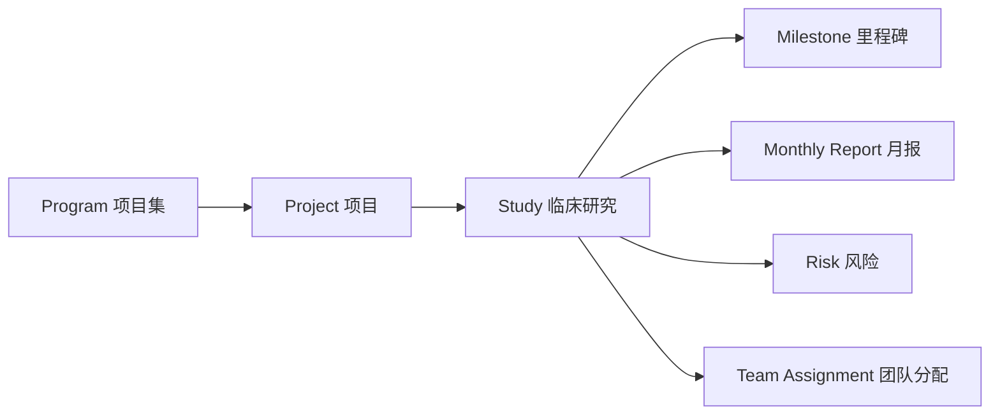

- Program、Project、Study 使用独立 ID；编号用于展示和查询，不作为跨表永久关联键。
- Project 归属一个 Program，并关联一个 TA 和适应症。
- Study 归属一个 Project，并记录当前 Phase。
- 里程碑、月报、风险和团队分配均落到 Study。

### 3.2 登录、会话与错误反馈

- 认证采用自建账号和服务端 Session；浏览器不得保存认证令牌。
- 修改数据的请求必须携带有效 CSRF 信息。
- 未登录 API 返回 `401` JSON；无权限 API 返回 `403` JSON。
- Vue 收到 `401` 后清空本地用户态并跳转登录页；登录成功后尽量返回原访问地址。
- 前端路由守卫会隐藏无权导航，并把无权路由重定向到第一个可访问页面；它只改善体验，不是安全边界。
- 业务校验、资源不存在、并发冲突应分别返回可识别的错误码和可读消息；页面不得只显示“系统错误”。

### 3.3 权限模型

一个用户可拥有多个启用角色，最终操作权限取角色权限编码并集。角色数据范围为：

- `ALL`：可访问全部 Study。
- `ASSIGNED_STUDY`：只可访问团队矩阵中分配给自己的 Study。
- 多角色中任一启用角色提供 `ALL` 时，最终数据范围为全部；否则合并所有被分配 Study。

新库默认种子中的 ADMIN、USER、VIEWER 当前均为 `ALL` 数据范围；这只是现有初始化行为，不代表已满足最小权限原则，正式上线前需确认 USER、VIEWER 的默认范围。

| 页面 / 能力 | 页面或读取权限 | 写操作权限 |
|---|---|---|
| 管线总览 | `pipeline.page.view` | 无 |
| Study | `study.read` | 由里程碑、月报、风险、团队各自权限控制 |
| 管线配置 | `config.page.view` | `config.create`、`config.update`、`config.delete` |
| 风险 | `risk.page.view`、`risk.read` | `risk.create`、`risk.update`、`risk.delete` |
| 里程碑 | `milestone.read` | `milestone.update` |
| Study 月报 | `monthly.read` | `monthly.create`、`monthly.update`；删除当前复用 `monthly.update` |
| 团队矩阵 | `team.page.view` | 进入编辑需同时具备 `team.edit_mode` 和 `team.update` |
| 月报导出 | `report.page.view` | `report.export` |
| 账号 | `account.page.view` | `account.create`、`account.update`、`account.assignRole`、`account.delete` |
| 角色 | `role.page.view` | `role.create`、`role.update`、`role.delete` |
| 平台设置 | `platform.setting.read` | `platform.setting.update` |

权限码不存在 `report.export.xlsx`、`report.print` 或 `monthly.delete`。格式差异由同一个业务权限控制。

### 3.4 查询、分页与排序

共享分页组件默认每页 10 条，可切换 10、20、50、100 条。以下为当前真实查询口径：

| 页面 | 当前查询条件 | 排序与分页 |
|---|---|---|
| 管线总览 | TA 精确匹配、Program 编号包含匹配、Phase 与阶段状态组合 | 一次加载聚合结果；无分页和用户排序 |
| Study 列表 | TA、Program 文本、里程碑节点 | 服务端分页；固定更新时间倒序；无表头排序 |
| 风险 | 编号/描述/Owner/Program 搜索，功能线、状态、等级 | 服务端分页；页面固定更新时间倒序 |
| 团队矩阵 | Study/适应症、角色/功能线 | 服务端按 Study 分页 |
| 管线配置 | Study 编号/TA/Program 搜索 | Study 服务端分页；Program/Project 整批加载 |
| 账号 | 姓名/邮箱搜索、角色筛选 | 服务端分页 |
| 角色 | 角色编码/说明搜索、状态筛选 | 服务端分页 |

管线总览的 Phase 选择只确定观察列；只有同时选择状态时才根据该列文案过滤 Project。筛选为空时显示授权范围内全部数据。

### 3.5 通用交互

- 写操作按钮由操作权限控制，服务端再次校验权限和数据范围。
- 删除、关闭风险、重置密码、停用账号等高影响操作需要确认。
- 风险、风险措施和团队矩阵等带版本字段的资源发生并发冲突时，返回 `409` 并提示刷新后重试。
- 里程碑及 Program/Project/Study 配置当前没有版本字段，存在后提交覆盖先提交的风险。
- 日期按用户可读格式展示，接口使用明确的日期或时间格式；月报月份使用 `YYYY-MM`。
- 表单校验失败时保留用户输入，并把错误定位到对应字段。

## 四、页面详细需求

### 4.0 登录与密码

#### 当前行为

- 登录页提交账号和密码；成功后加载当前用户、权限与数据范围。
- 顶部用户菜单支持退出和修改自己的密码。
- 新密码为 8 至 128 位，且至少包含大写字母、小写字母和数字；确认密码必须一致，新旧密码不能相同。
- 自助改密成功后保留当前 Session，使同一账号的其他 Session 失效。
- 管理员重置密码后，使目标账号全部现有 Session 失效。

#### 当前限制

- 新建账号和管理员重置统一使用固定初始密码 `Hd123456`。
- 未实现首次登录强制改密、忘记密码、MFA、登录限流和失败锁定。
- 固定初始密码只适合当前 MVP；正式上线前必须改为一次性随机凭据或安全激活流程。

#### 验收标准

- 错误当前密码不能修改密码。
- 密码复杂度不满足时，前后端均拒绝。
- 改密与重置接口不返回明文密码或密码散列。
- 重置后的旧 Session 不得继续调用受保护 API。

### 4.1 管线总览

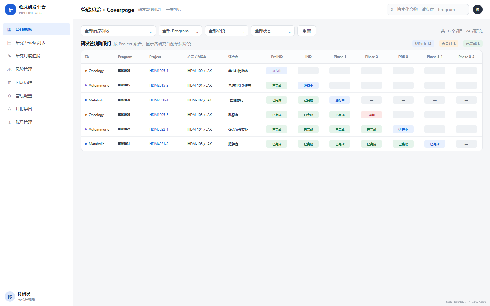

#### 当前行为

- 进入页面需要 `pipeline.page.view`。
- 按 TA 分组展示 Project；基础列为 Product、Program、Project/适应症，阶段列为 PreIND、IND、Phase 1、Phase 2、PRE-3、Phase 3-1、Phase 3-2。
- 支持 TA、Program、Phase、阶段状态筛选。
- 点击 Project 基础信息打开该 Project 下的 Study 卡片；有 `milestone.read` 时，阶段单元格可进入对应 Study 的里程碑。
- 阶段格悬停展示阶段、状态、更新时间和负责人等现有摘要。

#### 聚合口径

- 普通临床阶段只读取 Phase 精确匹配的 Study，不因为更晚 Phase 已存在而自动回填早期列为“已完成”。
- PreIND 与 IND 从 Phase 1 Study 的相关里程碑投影；PRE-3 从 Phase 3-1 Study 的相关里程碑投影。
- 同一 Project 同一 Phase 有多个 Study 时，选取更新时间最新的 Study 作为该列展示来源。
- 节点实际完成、当前 Phase 和全局完成状态共同决定展示文案；计算必须由固定规则和测试约束。

#### 当前未实现

- 通用全文搜索、快捷统计卡、TA 展开/收起。
- TA 内 Project 拖拽排序。
- PL 头像、本月更新点、Open 风险数、Project 状态列。
- 阶段“不适用”标记和完整来源解释。

#### 验收标准

- 没有 `milestone.read` 的用户可查看管线，但不能通过阶段格进入里程碑。
- Phase 单独选择不减少 Project 行数；选定状态后按对应阶段列筛选。
- 普通 Phase 不跨阶段回填，监管阶段映射结果与聚合规则测试一致。

### 4.2 Study 列表与详情

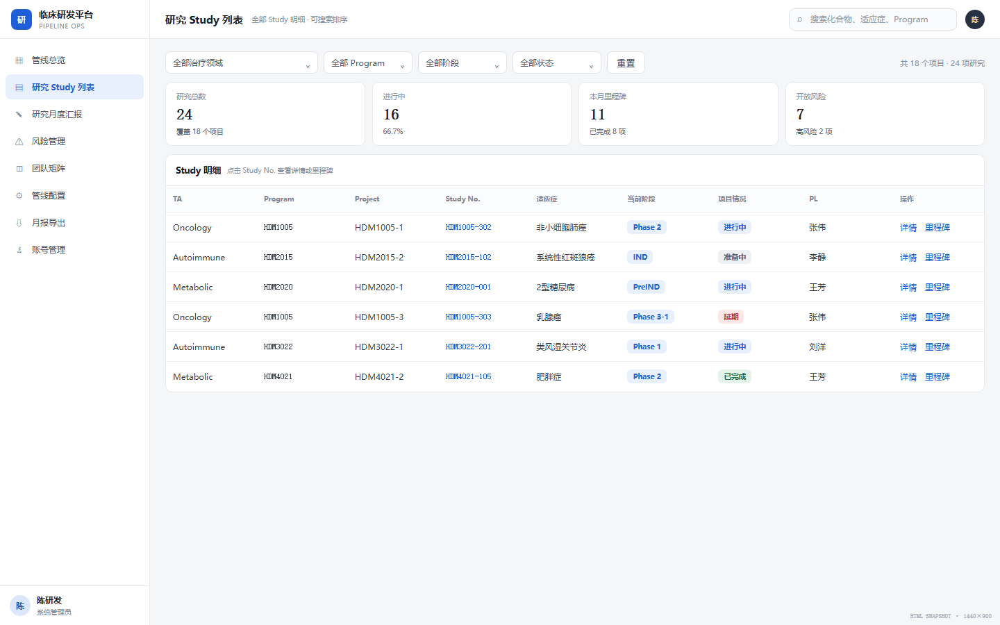

#### 当前行为

- 进入和查询需要 `study.read`，并在查询前应用 Study 数据范围。
- 支持 TA、Program 文本和里程碑节点筛选，服务端分页。
- 列表字段为 TA、Program、Product、Study No.、适应症、里程碑阶段/节点、PL/PM、更新时间和操作。
- 点击行打开详情抽屉。抽屉按权限显示里程碑、团队、风险三个只读 Tab。
- 团队 Tab 使用 `study.read` 与数据范围；风险 Tab 额外要求 `risk.read`。
- 行内“里程碑”和“月报”入口分别要求 `milestone.read` 和 `monthly.read`。

#### 状态口径

- Study 基础状态根据实际开始和实际结束日期推导为计划中、进行中、已完成。
- 有里程碑读取权限时，列表阶段/节点来自里程碑投影；无该权限时只能使用 Study 基础状态。
- 当前里程碑筛选先在最多 500 个候选 Study 中计算投影后再分页，这是已知技术限制。

#### 当前未实现

- Study No./产品/适应症通用全文搜索。
- 独立 Phase、Project 状态筛选和表头排序。
- Study No. 旁的 Open 风险数角标。

#### 验收标准

- `ASSIGNED_STUDY` 用户不能通过列表、详情抽屉或直接 API 访问未分配 Study。
- 切换筛选后页码回到第一页。
- 抽屉 Tab 和行内按钮同时遵守权限；隐藏按钮不能替代服务端校验。

### 4.3 Study 月报填报

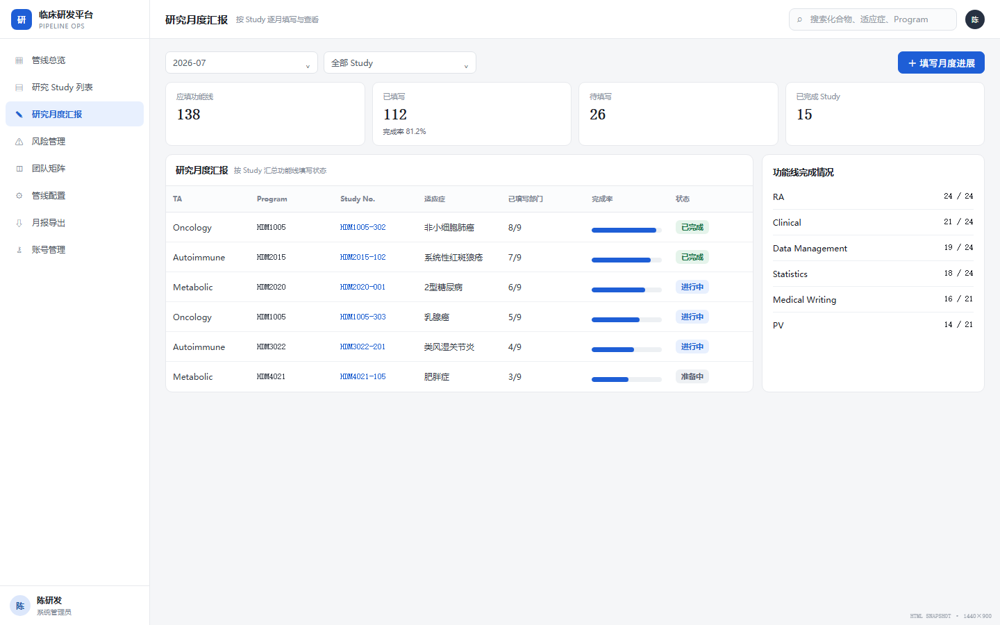

#### 当前行为

- 从 Study 列表进入，读取需要 `monthly.read`。
- 默认选择当前自然月；用户可切换月份。
- 页面按后端返回的功能线卡片展示，每个卡片包含是否可编辑的服务端判定。
- `ALL` 范围可维护目标 Study 的全部启用功能线；`ASSIGNED_STUDY` 用户只可维护自己在该 Study 被分配的功能线。
- 每个功能线、每个月可以保存多条独立进展。
- 新增需要 `monthly.create`；编辑和删除均使用 `monthly.update`。
- 每条内容必填，最多 4000 字；报告日期必填且必须落在所选月份内。
- 历史区固定展示所选月之前两个月的数据。

#### 当前未实现

- 跨 Study 完成率列表仍是骨架，侧栏不展示入口。
- “应填功能线数量、已填数量、完成率”的跨 Study 聚合尚未形成正式接口和验收口径。

#### 验收标准

- 用户不能选择未授权 Study，也不能伪造未分配功能线提交。
- 同一功能线同月可保存多条进展，编辑或删除其中一条不影响其他条目。
- 报告日期跨月、空内容或超过 4000 字时服务端拒绝。

### 4.4 风险管理

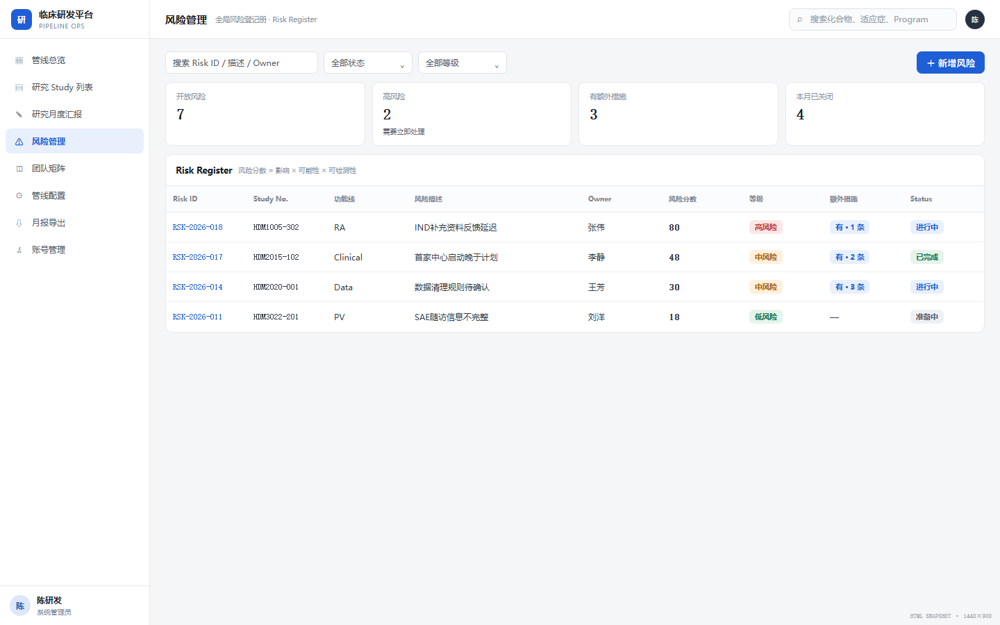

#### 当前行为

- 页面进入需要 `risk.page.view`，数据读取需要 `risk.read`；增改删分别使用 `risk.create`、`risk.update`、`risk.delete`。
- 支持风险编号/描述/Owner/Program 搜索，以及功能线、状态、等级筛选和服务端分页。
- 快捷卡展示总数、Open、高风险、中风险；统计由服务端返回。
- 页面固定按更新时间倒序，当前没有可点击表头排序。
- 新建风险先选择 Study，Program、Project 和适应症由 Study 关系只读带出。
- 登记日期必填；Owner 必须是目标 Study 当前启用团队成员；功能线必须在授权范围内。
- 初始和再评估因子 a、b、c 均为 1 至 5，分数为三者乘积。
- 风险等级使用数据库当前生效的风险评分规则；初始版本为低风险不高于 12、中风险不高于 36、高风险高于 36。
- 风险可有多条控制措施，措施状态为 OPEN、IN_PROGRESS、COMPLETED、CANCELLED；COMPLETED 必须填写实际完成日期。
- 控制措施负责人同样必须是目标 Study 当前团队成员。
- 关闭和重开必须填写原因；风险与措施更新使用版本号防止覆盖并发修改。

#### 统计与规则限制

- 当前统计卡会应用关键词、功能线和数据范围，但不会跟随状态和等级筛选；产品需决定是否统一为“随全部筛选变化”。
- 服务端可以选择当前生效的评分规则版本，但没有面向业务管理员的配置、审批或发布页面。

#### 验收标准

- 非团队成员不能被选为 Owner。
- 任一评分因子超出 1 至 5 时服务端拒绝。
- 关闭/重开没有原因时不能保存。
- 两个用户编辑同一版本时，后提交者收到冲突提示，不得静默覆盖。
- 措施增改删统一要求 `risk.update`，并记录审计动作。

### 4.5 团队矩阵

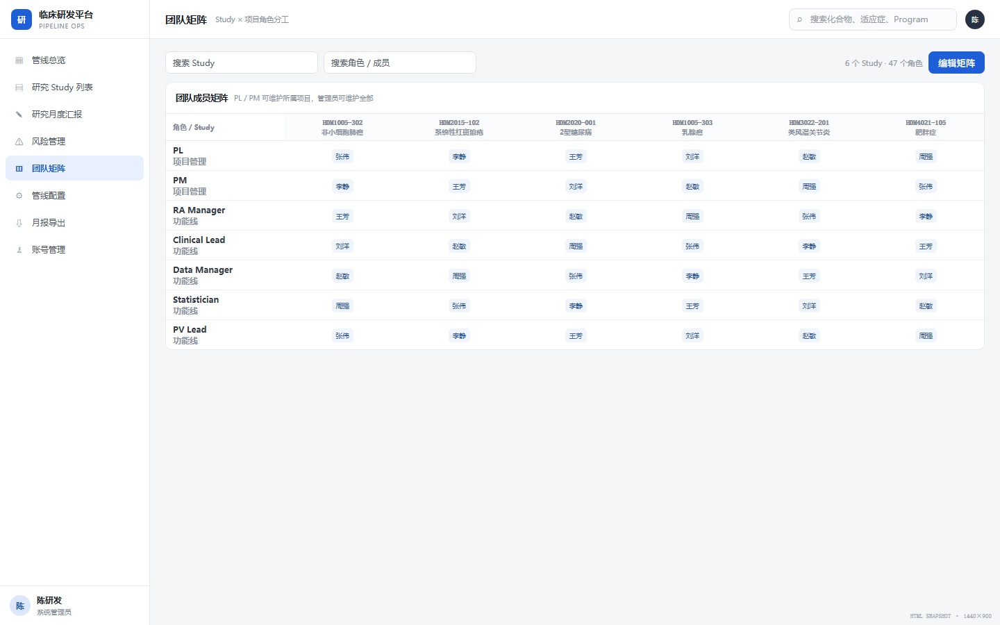

#### 当前行为

- 整页查询需要 `team.page.view`；进入编辑模式同时需要 `team.edit_mode` 和 `team.update`。
- 支持 Study/适应症搜索、角色/功能线搜索，以及 Study 服务端分页。
- 每行代表 Study，每列代表角色；单元格可分配一个或多个启用账号。
- 编辑先在页面暂存，再按 Study 批量提交，并携带该 Study 的团队版本。
- 版本冲突时提示刷新；移除自己的团队分配时提示可能立即失去该 Study 访问权。
- Study 状态根据实际开始/结束日期推导，不等同于当前里程碑节点状态。

#### 当前限制

- 成员选择器只加载前 100 个启用账号，没有按姓名或邮箱搜索。
- 切换搜索、分页或退出编辑模式会取消未保存草稿。

#### 验收标准

- 只有同时具备两个编辑权限时才可进入编辑状态。
- 保存失败不得丢失服务端原数据；并发冲突不得覆盖其他用户修改。
- 团队变更后，`ASSIGNED_STUDY` 数据范围在后续请求中按新分配生效。

### 4.6 管线配置

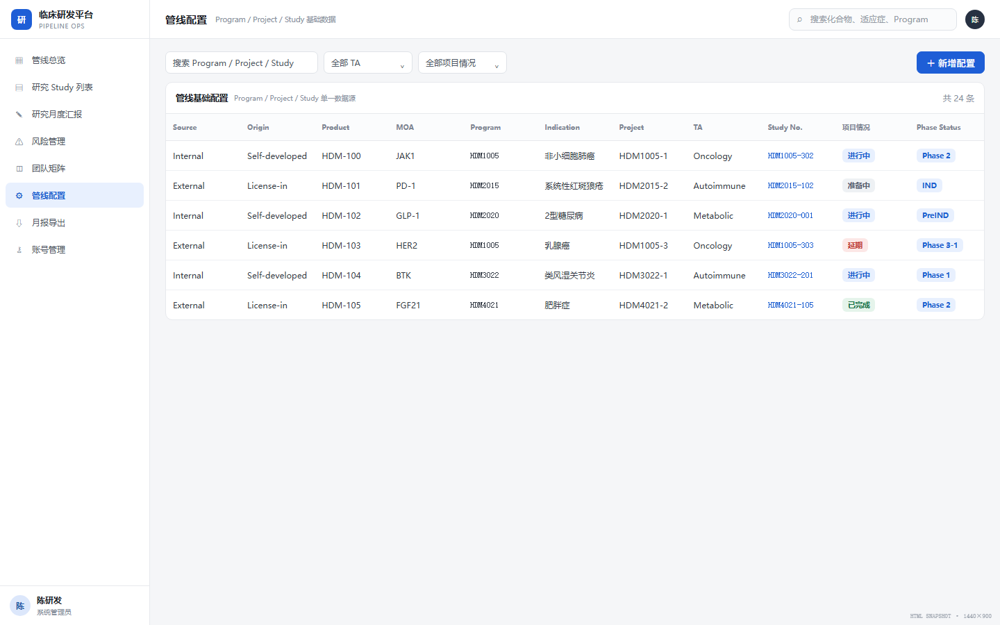

#### 当前行为

- 页面进入需要 `config.page.view`，新增、编辑、删除分别要求对应权限。
- 页面包含“Study 明细”和“Program/Project 管理”两个 Tab。
- Study 支持关键词查询、服务端分页和页容量切换；Program/Project 当前整批加载。
- Study 表单可快捷新建 Program 或 Project，成功后回到原表单继续选择。
- 编号创建后不可修改；删除有关联数据的实体时，服务端返回冲突与引用数量。
- TA 来自数据库字典。
- 配置属于平台全局主数据，按 `config.*` 权限控制，不按当前用户的 Study 数据范围裁剪。

#### 当前字段

| 实体 | 创建与维护字段 |
|---|---|
| Program | Program 编号、Product、MOA、Source、Origin |
| Project | Project 编号、所属 Program、TA、适应症 |
| Study | Study No.、所属 Project、Phase |

当前 Vue 配置页没有 Program 名称、Project 名称或 Study 名称输入项。后端 Study 契约支持的日期和描述字段尚未在该页面开放。

#### 当前限制

- Program/Project 未分页，查询存在批量上限。
- Program、Project、Study 配置更新尚无统一版本号并发控制。
- 配置页 TA 从服务端读取，但管线总览和 Study 列表的 TA 筛选仍使用前端固定选项，存在字典漂移风险。

#### 验收标准

- 编号唯一且创建后不可修改。
- 删除存在下游引用的记录时返回 `409`，页面展示可理解的引用原因。
- Study 只能关联已存在 Project，Project 只能关联已存在 Program 和 TA。

### 4.7 月报导出

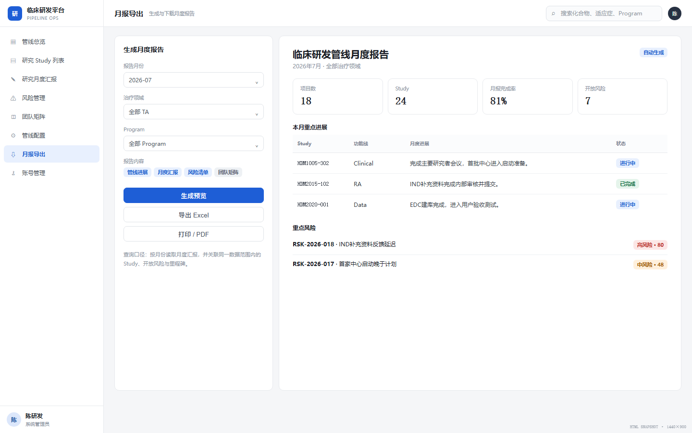

#### 当前行为

- 进入和预览需要 `report.page.view`，下载或打印需要 `report.export`。
- 默认起始日期为当月 1 日，结束日期为当天。
- 支持 `ALL`、TA 多选、Program 多选三种范围，并与当前用户数据范围取交集。
- 用户点击“生成月报”后加载预览。
- 支持 HTML、CSV、XLSX 下载；PDF 通过浏览器打印生成。

#### 当前限制

- 修改条件不会自动刷新或清空旧预览；用户必须再次点击“生成月报”。
- 若修改条件后直接下载，下载使用当前控件条件，而打印仍使用旧预览，可能产生口径漂移。
- 没有独立 PDF 引擎、后台导出任务、进度条和失败重试队列。
- 日期范围只限定月报进展；Study 状态快照和未关闭风险使用生成时的当前状态。
- CSV 已做字段引号转义，但尚未中和以 `=`、`+`、`-`、`@` 开头的公式内容，使用 Excel 打开前存在公式注入风险。

#### 验收标准

- 起始日期晚于结束日期时不能查询。
- 无 `report.export` 时可预览但不能看到导出按钮。
- 正式修复目标：任何条件变更都必须使旧预览失效，下载与打印只能基于同一已确认查询。

### 4.8 账号管理

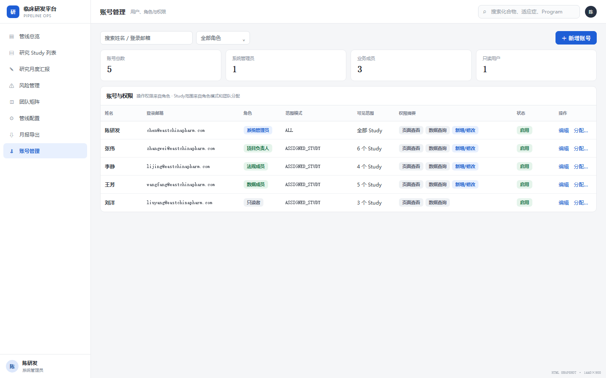

#### 当前行为

- 页面进入需要 `account.page.view`。
- 支持姓名/邮箱搜索、角色筛选、服务端分页和页容量切换。
- 支持新增账号、分配一个或多个角色、管理员重置密码、启用和停用。
- 新增使用 `account.create`，启停和重置使用 `account.update`，角色分配使用 `account.assignRole`。
- 登录邮箱新增时唯一，保存时转为小写。
- 新建和重置使用固定初始密码 `Hd123456`；重置使目标账号所有 Session 失效。

#### 当前限制

- 页面没有编辑显示姓名和删除账号入口；虽然服务端存在 `account.delete`，当前 UI 未使用。
- 页面没有展示所选角色带来的权限并集和数据范围摘要。
- 分配角色后不会立即使目标用户 Session 失效；用户调用刷新当前身份接口后才会加载新权限。
- 停用或删除账号后也不会主动清理该用户全部 Session。
- 服务端账号删除尚未保护“当前账号”和“最后一个具备权限管理能力的管理员”。

#### 验收标准

- 目标要求：停用、删除、角色重分配或重置密码后，旧 Session 不得继续访问受保护 API。
- 不得在列表、响应、日志或导出中出现密码或密码散列。
- 正式上线前必须补齐安全初始凭据、关键管理员删除保护和角色变更即时生效策略。

### 4.9 角色权限管理

#### 当前行为

- 页面进入需要 `role.page.view`，增删改分别使用对应权限。
- 支持角色编码/说明搜索、状态筛选、服务端分页。
- 角色编码唯一，新增时使用大写编码格式，创建后不可修改；角色说明用于展示。
- 权限编辑采用“模块分组 + 权限复选项”，至少选择一个权限。
- 数据范围选择 `ALL` 或 `ASSIGNED_STUDY`。
- 系统角色不能删除或停用；已经关联账号的角色不能删除。
- 修改角色定义后，使受影响账号的 Session 失效，并向管理员反馈影响人数。

#### 字段

| 字段 | 必填 | 规则 |
|---|---:|---|
| 角色编码 | 是 | 唯一，创建后锁定 |
| 角色说明 | 否 | 描述职责和适用人群 |
| 状态 | 是 | 启用/停用；系统角色不能停用 |
| 权限集合 | 是 | 至少一个，按模块分组选择 |
| 数据范围 | 是 | `ALL` 或 `ASSIGNED_STUDY` |

#### 验收标准

- 系统角色和已被账号使用的角色不能删除。
- 角色定义变化后，受影响旧 Session 失效；当前管理员若受影响，应返回登录页。
- 停用角色不再向用户提供权限和数据范围。

### 4.10 里程碑

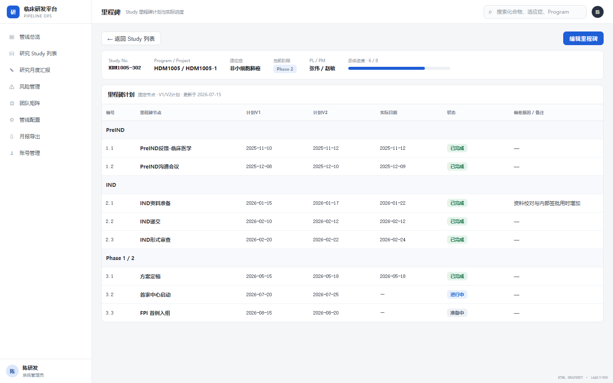

#### 当前行为

- 从 Study 列表、详情或管线阶段格进入；查询需要 `milestone.read` 和目标 Study 数据范围。
- 编辑需要 `milestone.update`，否则页面只读。
- 阶段组和节点顺序由 Java 固定定义，不通过数据库维护节点字典。
- 每个节点维护计划 V1.0、计划 V2.0、实际开始、实际结束和偏差说明。
- 节点状态由服务端计算：未开始、进行中、已完成。
- 阶段组最后节点完成后，该阶段显示完成；当前活动节点按固定顺序推进。
- 当前更新没有版本字段；多人同时编辑时可能由后提交覆盖先提交。
- 里程碑投影供 Study 列表和管线总览使用。

#### 验收标准

- 无 `milestone.update` 时不能进入编辑态，直接调用写 API 同样返回 `403`。
- 实际结束日期存在时节点为已完成；状态推导只由服务端统一实现。
- 管线总览监管阶段映射与里程碑固定节点保持一致。
- 目标要求：增加并发版本控制，避免后提交静默覆盖先提交。

## 五、关键业务流程

### 5.1 月报填报到导出

### 5.2 风险登记与跟踪

### 5.3 用户、角色与数据范围

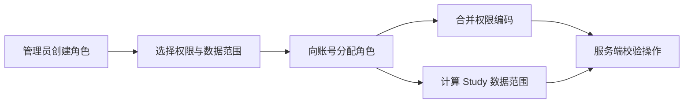

## 六、枚举与字典

### 6.1 TA

| Code | 名称 |
|---|---|
| ONCOLOGY | 肿瘤 |
| AUTOIMMUNE | 自身免疫 |
| METABOLIC_CARDIOVASCULAR | 代谢与心血管 |
| RESPIRATORY | 呼吸系统 |
| INFECTIOUS_DISEASE | 感染性疾病 |
| NEUROSCIENCE | 神经科学 |

TA 以数据库字典和服务端接口为唯一运行时来源，前端不应长期维护第二份固定列表。

### 6.2 Program 与 Project

- Source：自研、引进、合作。
- Origin：进口、国产。
- Project 必须关联 TA 和适应症。

### 6.3 Phase

当前 Phase 包含：PreIND、IND、Phase 1、Phase 2、PRE-3、Phase 3-1、Phase 3-2。接口使用稳定编码，页面显示人类可读标签。

### 6.4 里程碑组

- PreIND：递交及临床医学、数统、临床药理、非临床、药学反馈。
- IND：递交、形审发补、形审补正、受理、获批。
- Protocol：方案摘要定稿、方案讨论会、方案定稿。
- SSU：立项、伦理、合同、中心启动、人遗、CDE/ClinicalTrial 登记。
- Enrollment：FPI、LPI、LPO。
- IA：数据冻结、数据分析。
- Data & Report：DBL、TLR、TFL、CSR、中心关闭。
- PreNDA/BLA、NDA/BLA：上市申请前沟通及上市申请递交、核查、发补、获批。

### 6.5 功能线

| Code | 名称 | Code | 名称 |
|---|---|---|---|
| PM | 项目管理 | RA | 注册 |
| CM | 临床医学 | CP | 临床药理 |
| PV | 药物警戒 | TM | 试验管理 |
| CO | 临床运营 | Lab | 中心实验室 |
| Supply | 供应保障 | CTA | 临床试验协调 |
| ST | 生物统计 | PG | 统计编程 |
| DM | 数据管理 | MW | 医学写作 |
| NC | 非临床 | CMC | 药学 CMC |
| IP | 药品管理 | - | - |

### 6.6 风险

- 风险状态：OPEN、CLOSED。
- 评估因子：1、2、3、4、5。
- 风险等级：低风险、中风险、高风险；阈值来自当前生效规则版本。
- 措施状态：OPEN、IN_PROGRESS、COMPLETED、CANCELLED。

### 6.7 账号、角色与权限

- 系统可预置 ADMIN、USER、VIEWER，也允许创建自定义角色。
- 页面动作：`view`、`read`。
- 业务动作：`create`、`update`、`delete`、`export`、`edit_mode`、`assignRole`。
- 数据范围：`ALL`、`ASSIGNED_STUDY`。

## 七、数据与非功能要求

### 7.1 数据约束

| 要求 | 当前状态 |
|---|---|
| Program、Project、Study 使用独立 ID | 已实现 |
| Study No. 在有效数据中唯一 | 已实现 |
| 风险必须关联 Study 和功能线 | 已实现 |
| 风险 Owner 必须是目标 Study 启用团队成员 | 已实现 |
| 同一功能线同月允许多条月报进展 | 已实现 |
| 团队分配使用 `studyId + roleCode + userId` 唯一关系 | 已实现 |
| 风险、措施、团队使用版本控制 | 已实现 |
| 里程碑和管线配置使用版本控制 | 未实现 |
| 数据库外键和检查约束 | 当前未建立，主要依赖 Java 业务校验 |
| 所有配置和账号写操作都有不可覆盖审计历史 | 未实现 |

### 7.2 安全与合规

| 要求 | 当前状态 |
|---|---|
| Argon2 密码散列、服务端 Session、CSRF | 已实现 |
| 页面、操作和 Study 数据范围由服务端校验 | 已实现，需持续回归 |
| 响应和日志不暴露密码、散列和敏感健康信息 | 已实现基础防护，需安全测试 |
| 角色定义、团队、风险、里程碑、月报关键变更可追溯 | 部分实现 |
| 账号与全部动态配置具备不可覆盖审计历史 | 目标 |
| 忘记密码、MFA、限流、失败锁定、首次强制改密 | 目标 |
| GxP 电子记录、电子签名、审计追踪和验证 | 待业务确认；当前未完成 |

本系统不保存真实患者数据的需求。若未来引入受试者级数据，必须先完成数据最小化、脱敏、访问控制、留存和合规评估。

### 7.3 性能与可用性目标

以下均为目标，不代表已经完成压测：

- 常用列表筛选在正常网络和目标数据量下，页面可感知响应目标小于 500ms。
- 至少验证 1000 个 Study、10000 条风险下的分页查询和导出。
- 大导出应显示进度、失败原因并支持安全重试。
- 有未保存表单或团队草稿时，离开页面应提示。
- PC 基准宽度为 1440px；关键操作应支持键盘访问，表单错误应可定位。

### 7.4 可观测性与发布

- 当前提供健康检查和 Prometheus 指标。
- 生产前端必须通过非 mock 模式构建，并与后端打入同一个 Spring Boot JAR。
- 生产环境必须启用安全 Cookie，并在网络层限制 Prometheus 等运维端点。
- Flyway 迁移中包含演示管线和里程碑数据；正式生产发布前必须决定保留、迁移为测试夹具或移除，避免把演示数据写入生产库。
- 全量回归、Docker 构建和真实 MySQL 启动结果必须记录到验证记录；仅通过文档生成不能代表产品功能已验证。

## 八、验收与追踪

### 8.1 核心验收矩阵

| ID | 验收行为 | 验证方式 |
|---|---|---|
| AUTH-01 | 未登录 API 返回 `401`，无权操作返回 `403` | 安全集成测试 |
| AUTH-02 | 自助改密保留当前 Session 并失效其他 Session | 改密集成测试 |
| AUTH-03 | 管理员重置后目标全部 Session 失效 | 账号集成测试 |
| PERM-01 | 多角色权限取并集，数据范围按 `ALL` / `ASSIGNED_STUDY` 生效 | 角色与数据范围集成测试 |
| PIPE-01 | 管线普通 Phase 不跨阶段回填，监管阶段按里程碑映射 | 前端领域规则测试 + 页面检查 |
| STUDY-01 | Study 列表先应用数据范围，再筛选和分页 | Study 集成测试 |
| MONTH-01 | 功能线权限、跨月日期、内容长度和多条明细口径正确 | 月报集成测试 |
| RISK-01 | 评分、等级、Owner、状态原因和并发版本均由服务端校验 | 风险集成测试 |
| TEAM-01 | 编辑需要双权限，批量更新遇到版本冲突不覆盖 | 团队集成测试 |
| MILE-01 | 固定节点状态和管线阶段投影一致 | 里程碑集成测试 + 聚合测试 |
| REPORT-01 | 预览与导出不超出用户数据范围 | 导出集成测试 |
| DOC-01 | PRD Markdown 可生成离线 HTML，版本、图片、锚点和脚本有效 | 文档生成测试 + 浏览器检查 |

### 8.2 追踪入口

- API 与本地运行：[MVP 运行与 API 说明](MVP运行与API说明.md)
- 架构边界：[ADR-001](decisions/ADR-001-采用模块化单体与页面读模型.md)
- 认证决策：[ADR-003](decisions/ADR-003-采用自建账号与服务端Session.md)
- 数据库目标模型：[ADR-005](decisions/ADR-005-采用统一hd_plt目标数据库模型.md)
- Vue 与路由决策：[ADR-006](decisions/ADR-006-采用Vue单页应用与扁平平台路由.md)
- 实际验证证据：[验证记录](验证记录_v1.0.md)

埋点事件 `page_view`、`filter_change`、`study_open`、`monthly_save`、`risk_save`、`report_export`、`permission_denied` 目前属于观测计划，前端尚未统一实现，不能作为现有能力。

## 九、已知差距与产品决策

| 编号 | 优先级 | 状态 | 问题 / 下一步 |
|---|---|---|---|
| D-01 | P1 | 目标 | 跨 Study 月报完成率列表需定义应填、已填、逾期和完成率口径后再开发 |
| D-02 | P2 | 目标 | 管线 TA 折叠、快捷统计和拖拽排序；先确认排序是否全局共享及谁可维护 |
| D-03 | P0 | 目标 | 用安全的一次性初始凭据替换固定密码，并补首次登录强制改密 |
| D-04 | P1 | 目标 | 补 MFA、登录限流、失败锁定和忘记密码流程 |
| D-05 | P0 | 部分实现 | 账号停用、删除、角色重新分配后应立即失效旧 Session；当前仅角色定义变更和重置密码会主动失效 |
| D-06 | P0 | 目标 | 保护当前管理员和最后一个权限管理员，补齐账号删除 UI 与服务端约束 |
| D-07 | P1 | 部分实现 | 风险评分已使用数据库生效版本，但缺少配置、审批、发布和历史查询页面 |
| D-08 | P1 | 待业务确认 | 风险统计卡是否跟随状态/等级筛选；当前不会跟随 |
| D-09 | P1 | 目标 | 月报导出条件变化后使旧预览失效，统一预览、下载和打印查询 |
| D-10 | P1 | 目标 | 消除 Study 里程碑筛选最多 500 个候选的限制 |
| D-11 | P1 | 目标 | 团队成员选择支持服务端账号搜索，不再限制前 100 个启用账号 |
| D-12 | P1 | 目标 | Program/Project 分页，并为配置写操作增加一致的并发控制 |
| D-13 | P0 | 待发布确认 | 生产 Flyway 是否允许写入演示管线和里程碑数据 |
| D-14 | P1 | 目标 | 补齐账号、配置和高影响操作的不可覆盖审计历史 |
| D-15 | P2 | 待业务确认 | 是否建设独立 PDF 引擎；当前浏览器打印已满足基础输出 |
| D-16 | P0 | 目标 | CSV 导出中和公式前缀，防止表格软件把用户内容作为公式执行 |
| D-17 | P1 | 目标 | 为里程碑增加并发版本控制，避免多人编辑时后写覆盖 |
| D-18 | P1 | 待业务确认 | 调整默认 USER、VIEWER 数据范围，避免新库种子默认授予全部 Study |

## 十、HTML 页面截图说明

- 截图源文件：[html-screenshot-source.html](html-screenshot-source.html)，通过查询参数 `page` 切换页面。
- 截图基准为 1440×900，用于布局、入口和字段呈现对齐。
- 截图不是当前 Vue 运行证据；字段真源、计算和权限以当前代码、接口与本 PRD 明确口径为准。
- PRD 内容只编辑本 Markdown，再运行 `node docs\generate-prd-html.js` 生成 HTML；不得手工修改生成文件。
