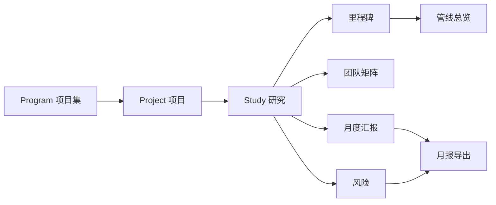
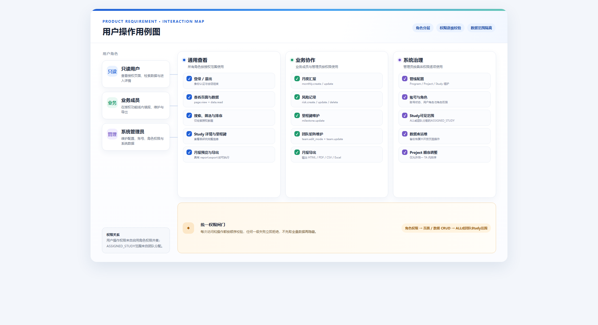
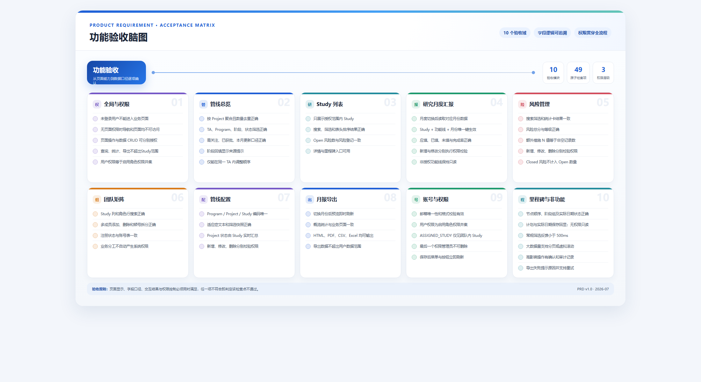
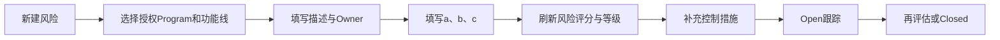

# 临床研发管线管理系统 PRD

> 文档版本：V1.0  
> 编制日期：2026-07-16  
> 产品形态：PC Web  
> 当前实现依据：[管线总览 Coverpage.dc(2).html](../管线总览%20Coverpage.dc(2).html)  
> HTML页面截图：[截图入口](html-screenshot-source.html) · [截图目录](screenshots/)

## 0. 文档说明

本文依据现有可运行原型反向梳理，用于产品、业务、设计和研发对齐。标记为“现状”的内容表示当前代码行为；标记为“建议”的内容表示正式产品化时应采用的口径，不应与现状缺陷混为一谈。

### 0.1 当前实现快照（2026-07-22）

- 已接入真实后端：登录与 Session、账号管理、角色权限管理、管线总览、Study 列表，以及 Program/Project/Study 管线配置 CRUD 和 TA 下拉字典。
- 管线配置中的 TA 是 Therapeutic Area，即治疗领域；例如肿瘤、自身免疫。
- 月报、风险、团队矩阵、里程碑和导出仍属于后续业务切片，当前页面不代表其后端闭环已经完成。
- Session 过期后，页面导航和 Vue 内的下一次 API 请求都会转到登录页；API 调用仍返回标准 `401` JSON，`403` 继续表示权限不足。

### 0.2 医药术语

| 术语 | 解释 |
|---|---|
| Program | 项目集，通常围绕同一产品或研发方向组织多个项目。 |
| Project | 项目，通常对应产品在某个适应症上的研发项目。 |
| Study | 临床研究，是本系统进展、团队、里程碑和月度汇报的主要明细单元。 |
| TA | Therapeutic Area，治疗领域，如肿瘤、自身免疫。 |
| MOA | Mechanism of Action，作用机制。 |
| PL / PM | Project Lead / Project Manager，项目负责人 / 项目经理。 |
| PreIND / IND | IND前沟通 / 临床试验申请。IND获批后，药物才可按批准方案进入临床研究。 |
| FPI / LPI / LPO | 首例受试者入组 / 末例受试者入组 / 末例受试者完成末次访视。 |
| DBL / CSR | 数据库锁定 / 临床研究报告。 |

## 一、需求背景及分析

### 1.1 背景

临床研发数据分散在管线表、Study台账、团队矩阵、风险登记和月度汇报中，项目负责人难以快速回答“当前处于什么阶段、谁负责、有哪些风险、本月发生了什么”。系统通过 `Program → Project → Study` 层级汇集数据，以Study台账为明细真源，形成管线聚合、风险管理、团队协作和月报输出闭环。

### 1.2 产品目标

- 一屏查看研发管线阶段和异常状态。
- 以Study为最小业务单元维护里程碑、团队、风险和月度进展。
- 通过“用户—角色—权限”模型统一控制页面访问、页面操作和业务数据增删改查。
- 自动汇总月度数据，降低人工拼接报告成本。
- 保留明确的数据来源、计算口径和字段约束。

### 1.3 核心数据层级



## 二、需求范围

| 模块 | 页面/入口 | 核心能力 | HTML页面截图 |
|---|---|---|---|
| 登录与权限 | 登录页、全局导航 | 登录、退出、角色分配、角色权限和Study可见范围控制 | 纳入[08 账号与权限管理](screenshots/08-account-permissions.png) |
| 管线总览 | 左侧导航“管线总览” | Project聚合、阶段门展示、筛选、状态提示 | [01 管线总览](screenshots/01-pipeline-overview.png) |
| Study列表 | 左侧导航“研究 Study 列表” | Study明细、搜索、筛选、排序、进入详情/里程碑 | [02 Study列表](screenshots/02-study-list.png) |
| 研究月度汇报 | 左侧导航“研究月度汇报” | 按Study和功能线逐月填写、查看完成率 | [03 研究月度汇报](screenshots/03-monthly-reporting.png) |
| 风险管理 | 左侧导航“风险管理” | 风险登记、三因子评分、措施与关闭管理 | [04 风险管理](screenshots/04-risk-management.png) |
| 团队矩阵 | 左侧导航“团队矩阵” | Study×项目角色的业务分工维护 | [05 团队矩阵](screenshots/05-team-matrix.png) |
| 管线配置 | 左侧导航“管线配置” | Program/Project/Study基础配置 | [06 管线配置](screenshots/06-pipeline-config.png) |
| 月报导出 | 左侧导航“月报导出” | 月报预览、HTML/PDF/CSV/Excel输出 | [07 月报导出](screenshots/07-monthly-export.png) |
| 账号管理 | 管理员导航“账号管理” | 账号新增、编辑、删除和角色分配 | [08 账号与权限管理](screenshots/08-account-permissions.png) |
| 角色权限管理 | 管理员导航“角色权限管理”，位于账号管理之后 | 角色新增、编辑、删除和权限配置 | [08 账号与权限管理](screenshots/08-account-permissions.png) |
| 里程碑 | Study列表“里程碑” | V1/V2计划日期、实际日期和偏差原因维护 | [09 里程碑](screenshots/09-milestones.png) |

## 三、全局产品规则

### 3.1 搜索、筛选与排序

#### 3.1.1 通用查询规则

- 系统必须先根据页面查看权限、数据查询权限和数据范围取得用户可见数据，再执行搜索、筛选、统计和排序；不得先统计全量数据再隐藏无权限明细。
- 同一页面内，文本搜索、下拉筛选和快捷筛选之间采用“且（AND）”关系；数据必须同时满足全部已启用条件。
- 搜索不区分英文大小写，输入为空时不限制结果；下拉框选择“全部”时不限制对应字段。
- 点击已经激活的快捷筛选可取消该条件；点击“清空筛选”后，搜索词置空、所有下拉框恢复“全部”、快捷筛选恢复未选中。
- 排序只作用于当前权限和筛选结果，不改变底层业务数据及管理员维护的业务顺序。

#### 3.1.2 管线总览

- **文本搜索**：匹配化合物、适应症、Program、PL和PM，任一字段包含搜索词即命中。
- **TA筛选**：精确匹配Study所属治疗领域；“全部”显示授权范围内全部TA。
- **Program筛选**：产品口径为精确匹配所选Program；“全部”不限制Program。现有HTML虽然标签显示“Program”，但选项来源和判断实际使用 `compound` 字段，属于现状字段映射问题，正式实现必须改为 `programId/programCode`。
- **阶段/状态筛选**：选择阶段或状态后刷新Project结果，具体命中条件写在4.1对应字段行。
- **快捷筛选**：支持“需关注、已获批、本月有更新”；同一时间只激活一个快捷筛选，再次点击当前项则取消。命中和计数口径写在4.1对应字段行。
- **排序**：不提供通用表头排序；管理员可在同一TA分组内拖拽调整Project业务顺序，不能跨TA拖拽。

#### 3.1.3 Study列表

- **文本搜索**：匹配化合物、适应症、Program、PL和PM，任一字段包含搜索词即命中。
- **筛选项**：TA、Program、阶段、状态；判断逻辑与管线总览一致，但结果粒度为Study，不再按Project聚合。
- **排序字段**：TA、Program、Compound、Indication、Study No.、当前阶段、状态、PL/PM、最近更新均可排序。
- **排序交互**：首次点击表头按升序排列；再次点击同一表头切换为降序；点击其他表头后切换排序字段并从升序开始。默认按Program升序。

#### 3.1.4 研究月度汇报

- **月度筛选**：选择月度后，列表和详情均只读取所选月的填报内容；默认展示月份列表中的最新月度。
- **排序字段**：TA、Program、Compound、Indication、Study No.和已填写部门数可排序；重复点击同一表头切换升序/降序。
- **详情切换**：点击Study进入详情后沿用当前月度；切换月度时刷新列表、详情和汇总字段。

#### 3.1.5 风险管理

- **文本搜索**：匹配风险描述、Owner、Risk ID和Program，任一字段包含搜索词即命中。
- **功能线筛选**：精确匹配风险记录的功能线；选项来源于当前授权范围内已有风险的功能线去重值。
- **状态筛选**：可选择“全部、Open、Closed”；精确匹配风险记录状态。
- **统计卡筛选**：点击风险总数卡清除状态和等级快捷条件；点击Open卡清除等级条件；点击高危或中风险卡清除Open/Closed状态条件。各卡命中和计数口径写在4.4对应字段行。
- **排序字段**：Study No.、Program、Project、Risk ID、风险描述、功能线、风险分数、风险归属和状态均可排序；重复点击同一表头切换升序/降序。

#### 3.1.6 团队矩阵

- **横向Study搜索**：同时匹配Study No.和适应症；任一字段包含搜索词即保留对应Study列。
- **纵向角色搜索**：匹配角色名称；包含搜索词的角色行保留。
- 两个搜索框独立输入并同时生效，最终矩阵为命中的Study列与角色行的交集；页面上的“研究数、角色数”随结果刷新，计数口径写在4.5对应字段行。
- 团队矩阵不提供表头排序，Study保持业务数据顺序，角色保持系统预置的角色分组顺序。

#### 3.1.7 管线配置

- 页面提供两个视图：“Study 明细”按一个 Study 一行平铺 Program/Project/Study 关系；“Program / Project 管理”提供父子实体维护入口。
- Program 或 Project 编号输入后先查询实体：编号已存在时加载原数据并进入更新模式，不存在时进入新建模式；编号创建后不可修改。新建时数据库名称字段自动取相同编号，页面不单独要求名称。
- Study 表单只绑定已保存的 Project ID；允许在表单内快捷新建 Project，但必须先创建真实 Project 实体，成功后再回填选择结果。
- Program、Project 重命名前必须展示关联 Project/Study 数量并再次确认；预览后数据发生变化时拒绝提交并要求重新预览。
- 有下游引用时删除返回冲突，不做级联删除。配置页不展示或维护 Project 状态；Project 状态由管线总览根据下属 Study 实时计算。

#### 3.1.8 月报导出

- 通过报告月度查询数据；切换月度后立即按所选月份重建预览。
- 页面不提供文本搜索和结果排序；管线快照按TA及系统业务顺序展示，报告各分区按预设顺序输出。

#### 3.1.9 账号管理

- 现状账号列表不提供有效的搜索、筛选和表头排序，按照账号数据保存顺序展示。
- 顶部通用搜索框当前不参与账号列表计算；正式产品账号查询匹配显示姓名、登录邮箱和角色。

#### 3.1.10 里程碑

- 从Study列表带入目标Study，仅展示该Study的里程碑，不提供跨Study搜索。
- 里程碑按阶段组和系统预置节点顺序展示，不提供筛选和表头排序。

### 3.2 权限模型与鉴权

权限采用“用户—角色—权限”模型，由管理员维护，不再根据团队矩阵中的姓名自动推导系统权限。

#### 3.2.1 权限关系

1. 用户被管理员分配一个或多个角色。
2. 每个角色配置一组标准权限，角色用于批量复用权限模板。
3. 不支持对单个用户追加或禁用权限；用户最终操作权限为其所有启用角色权限的并集。
4. 所有权限判断均使用稳定的 `userId、roleId、permissionCode`，姓名和邮箱快照只用于展示与审计。

#### 3.2.2 权限维度

| 权限层级 | 控制内容 | 权限示例 |
|---|---|---|
| 页面查看权限 | 是否显示导航、是否允许进入页面 | `pipeline.page.view`、`risk.page.view`、`account.page.view` |
| 页面操作权限 | 页面级按钮和非单条数据操作 | `report.export.xlsx`、`report.print`、`team.edit_mode` |
| 数据查询权限 | 是否可以读取列表、详情、统计和导出数据 | `study.read`、`risk.read`、`monthly.read` |
| 数据新增权限 | 是否可以创建业务记录 | `risk.create`、`monthly.create`、`account.create` |
| 数据修改权限 | 是否可以修改业务记录 | `risk.update`、`milestone.update`、`config.update` |
| 数据删除权限 | 是否可以删除业务记录 | `risk.delete`、`config.delete`、`account.delete` |

#### 3.2.3 数据范围

角色的数据范围模式仅有：

- `ALL`：查看全部Study及其关联数据。
- `ASSIGNED_STUDY`：仅查看 `hd_plt_team_assignment` 中分配给当前账号的Study及其关联数据。

管理员不再为用户手工选择TA、Program、Project、功能线或“本人创建”等范围。管理员将账号分配到某个Study团队后，该Study即进入用户可见范围；移除团队分配后不可见，但不会改变历史月报完成率。

#### 3.2.4 鉴权顺序

```text
登录用户 → 汇总角色权限 → 校验页面/数据动作权限 → 按角色范围模式取得可见Study → 允许/拒绝
```

- 页面无查看权限：导航不展示，直接访问返回无权限页面。
- 有页面查看权限但无查询权限：页面可进入，但不返回业务数据。
- 有查询权限但无新增/修改/删除权限：页面只读，相应按钮隐藏或禁用。
- 前端负责交互提示，服务端必须再次鉴权并记录拒绝原因。

### 3.3 通用字段类型

| 类型 | 说明 |
|---|---|
| String | 单行文本。编号字段建议限制长度并去除首尾空格。 |
| Text | 多行文本。 |
| Enum | 单选枚举。 |
| MultiEnum | 多选枚举。 |
| Date | `YYYY-MM-DD`。 |
| Month | `YYYY-MM`。 |
| Integer | 整数。 |
| Boolean | 是/否。 |
| Reference | 对其他业务对象的引用。 |
| Derived | 计算字段，只读。 |

## 四、页面详细需求

## 4.1 管线总览


### 页面功能与交互

- 默认按TA分组，每个TA可展开/收起。
- 展示Project级管线结果。
- 支持TA、Program、阶段、状态筛选，以及“需关注、已获批、本月有更新”快捷筛选。
- 点击Project基础信息打开Study集合面板；点击阶段单元格进入映射的Study详情。
- 悬停阶段状态展示阶段、状态、负责人、更新时间及回填说明。
- 管理员可拖拽调整TA内Project顺序。

### 展示字段

| 字段 | 来源 | 类型 | 展示/计算逻辑 | 枚举 |
|---|---|---|---|---|
| TA分组 | Study.ta | Enum | 按TA分组，数量为分组内去重Project数 | 见6.1 |
| Project行 | Study.project | Derived/Reference | 以Project ID为行主键；先筛选授权范围内Study，再按Project去重聚合；同一Project至少一个Study命中时展示一行 | - |
| Product | Study.compound | String | 取Project下首个Study产品名；同一Project存在不同Product时标记数据异常，不静默覆盖 | - |
| 来源/国内外 | Config.source/origin | Enum | 以“来源 · 国内外”显示 | 见6.2 |
| Program (MOA) | Study.program/modality | String | 主行显示Program/产品，副行显示MOA或剂型 | - |
| Project (Indication) | Study.project/indication | String | Project去重；多个适应症以 `/` 拼接 | - |
| PL头像 | Team.PL | Derived | Project下PL去重；多人显示 `+N` | - |
| 本月更新点 | Study.updatedAt、Milestone.updatedAt、MonthlyReport.updatedAt | Derived Boolean | Project下任一Study的基础信息、阶段状态、里程碑或月度汇报更新时间落在当前自然月内则为true并显示蓝点；现有HTML暂以 `upd=true` 代替 | true/false |
| 阶段状态 | Config.phaseStatus、Milestone | Derived | 每个Study先由Phase Status映射到PreIND至Phase 3-2中的一列；当前阶段显示当前节点；当前阶段以前若无实际阶段项目则回填“已完成”并显示“实际无项目，由后续阶段回填”；PreIND/IND优先依据对应里程碑实际开始/结束日期推导节点；“未开始”和“不适用”不视为已进入该阶段 | 见6.3、6.4 |
| 阶段筛选命中 | 阶段状态 | Derived Boolean | 所选阶段对应单元格不是“未开始”且不是“不适用”时为true；先按Study判断，再由Project行汇总为“任一Study命中即命中” | true/false |
| 状态筛选命中 | 阶段状态 | Derived Boolean | Study任一阶段单元格与所选状态完全相同时为true；Project下任一Study为true则保留Project行 | true/false |
| 项目状态 | Study、Risk、Milestone | Derived/Enum | 不落库、不配置；根据Project下属Study的阶段、里程碑和风险数据实时汇总计算，具体优先级由Java统一实现 | 进行中、已完成、准备中、延期 |
| Open风险数 | Risk.status | Derived Integer | 统计Project下全部授权Study关联且 `status=Open` 的Risk记录数；同一Risk ID只计1次 | 非负整数 |
| 需关注数 | 阶段状态 | Derived Integer | 先判断Study任一阶段是否为橙色状态“已反馈、补正中、已发补、已书补”或红色状态“逾期、风险”，再按Project ID去重计数；该数不等于Risk记录数 | 非负整数 |
| 已获批数 | 阶段状态 | Derived Integer | Study任一阶段状态精确等于“已批准”即命中，再按Project ID去重计数；Close、DBL、CSR不计入已获批 | 非负整数 |
| 本月有更新数 | 本月更新点 | Derived Integer | 统计本月更新点为true的Project数，按Project ID去重 | 非负整数 |
| 筛选结果数 | Project行 | Derived Integer | 对同时满足搜索、TA、Program、阶段、状态和快捷筛选条件的Project ID去重计数 | 非负整数 |

## 4.2 Study列表


### 页面功能与交互

- 展示授权范围内全部Study明细。
- 支持全局搜索、四类筛选和表头排序。
- 点击行打开Study详情抽屉；点击“里程碑”进入里程碑页。
- Study编号旁展示Open风险数量。

### 字段

| 字段 | 来源 | 类型 | 逻辑 | 枚举 |
|---|---|---|---|---|
| TA | Study.ta | Enum | 转换为中文治疗领域 | 见6.1 |
| Program | Study.program | Reference/String | 原值展示 | - |
| Compound | Study.compound | String | 原值展示 | - |
| Indication | Study.indication | String | 适应症 | - |
| Study No. | Study.study | String | Study业务编号；旁附Open风险数，数量为该Study关联且 `status=Open` 的Risk ID去重计数 | - |
| 当前阶段 | Milestone group | Derived | 根据Study已到达的最深阶段或配置的Phase Status映射里程碑阶段组 | PreIND、IND、Protocol等 |
| 状态 | Milestone | Derived | 在当前阶段组内，从前到后读取节点：存在Actual Start且无Actual End时显示该节点；存在Actual End且不是最后节点时显示下一节点；最后节点存在Actual End时显示“已完成”；均无实际日期时显示组内首节点 | 见6.4 |
| PL / PM | Team.PL/PM | Derived | `PL / PM` 拼接 | - |
| 最近更新 | Study.updatedAt、关联记录updatedAt | Derived/DateTime | 取Study基础信息、里程碑、月度汇报和风险记录中最大的 `updatedAt`；现状仅显示演示月 | - |
| 结果数量 | Study.study | Derived Integer | 对当前权限范围内同时满足搜索、TA、Program、阶段和状态条件的Study ID去重计数 | 非负整数 |
| 操作 | - | Action | 打开里程碑页 | - |

## 4.3 研究月度汇报


### 页面功能与交互

- 列表模式：按月查看全部Study的已填写功能线数量和完成情况。
- 详情模式：查看选中Study各功能线本月填报、历史月份和完成率。
- 新增时选择功能线、月度并填写进展；编辑时功能线锁定。
- 用户仅能编辑自己可见Study中、团队角色所对应功能线的月报；新增、修改分别校验 `monthly.create`、`monthly.update`。
- `Study + 功能线 + 月度` 对应一条月报应填项；一个月内每次汇报新增一条独立进展明细，不覆盖之前的汇报。
- 月报不需要提交、审核、退回或批准流程。

### 列表字段

| 字段 | 类型 | 逻辑 |
|---|---|---|
| TA | Enum | Study所属治疗领域 |
| Program | String | Study所属Program |
| Compound | String | 产品/化合物 |
| Indication | String | 适应症 |
| Study No. | String | Study编号 |
| 应填功能线数 | Derived Integer | 统计团队矩阵中该Study已配置且在册的功能线去重数量 |
| 已填写部门 | Derived Integer | 在应填功能线中，统计所选月份月度进展文本去除首尾空格后非空的功能线数量 |
| 未填写功能线数 | Derived Integer | `应填功能线数 - 已填写部门`，结果不得小于0 |
| Study完成率 | Derived Percentage | `已填写部门 ÷ 应填功能线数 × 100%`，四舍五入取整数；应填功能线数为0时显示“—”，不参与整体完成率计算 |
| 页面应填功能线数 | Derived Integer | 对当前权限范围内全部可见Study的应填功能线数求和 |
| 页面已填报数 | Derived Integer | 对当前权限范围内全部可见Study的已填写部门数求和 |
| 页面未填报数 | Derived Integer | `页面应填功能线数 - 页面已填报数` |
| 页面完成率 | Derived Percentage | `页面已填报数 ÷ 页面应填功能线数 × 100%`，四舍五入取整数；分母为0时显示“—” |
| 完整填报研究数 | Derived Integer | 统计 `应填功能线数 > 0` 且 `已填写部门 = 应填功能线数` 的Study ID去重数量 |

### 填报字段

| 字段 | 类型 | 必填 | 逻辑 | 枚举 |
|---|---|---:|---|---|
| Study | Reference | 是 | 由详情页带入并锁定 | 授权Study |
| 功能线 | Enum | 是 | 新增可选；编辑锁定；受权限过滤 | 见6.5 |
| 月度 | Month/Enum | 是 | 默认当前选择月份 | 系统月份列表 |
| 汇报日期 | Date | 是 | 默认当天；同月允许多次汇报 | 所选月度内日期 |
| 月度进展 | Text | 否 | 可换行；至少一条未删除且非空的进展明细时，该功能线计为已填写 | - |

## 4.4 风险管理


### 页面功能与交互

- 展示授权项目的风险登记册。
- 支持功能线、状态筛选；支持描述/Owner/编号/Program搜索；支持表头排序。
- 风险统计卡展示总数、Open、高危、中风险并可作为快捷筛选。
- 点击风险打开查看/编辑抽屉；有额外措施时显示“含N项措施记录”。
- 风险新增、编辑、删除分别校验 `risk.create`、`risk.update`、`risk.delete`，并校验目标Study属于当前用户可见范围。

### 列表字段

| 字段 | 类型 | 逻辑 |
|---|---|---|
| Study No. | Reference | 风险关联Study |
| Program | Reference | 风险关联Program |
| Project | Derived | 通过Program回查Project |
| Risk ID | String | 新建时自动生成；建议后端生成唯一编号 |
| 风险描述 | Text | 必填；存在额外措施字段时附“含N项措施记录”标签，N的计算见“额外措施数量N”字段 |
| 功能线 | Enum | 风险归属部门/功能线 |
| 评分 | Derived Integer | `影响程度a × 发生可能性b × 可探测性c`，范围1~125；任一因子为空时不计算并提示补全 |
| 风险等级 | Derived Enum | 按风险总分计算：高危 `≥37`；中风险 `13~36`；低风险 `1~12` |
| 风险归属 | Reference/String | Owner，必填 |
| 状态 | Enum | Open或Closed |
| 风险措施数量N | Derived Integer | 对该风险关联且未逻辑删除的措施记录ID去重计数 |
| 风险总数卡 | Derived Integer | 在当前权限范围、功能线筛选和文本搜索结果内，对Risk ID去重计数；不受状态和风险等级快捷筛选影响 |
| 未关闭Open卡 | Derived Integer | 在风险总数卡口径内，统计 `status=Open` 的Risk ID去重数量 |
| 高危卡 | Derived Integer | 在风险总数卡口径内，统计风险总分 `≥37` 的Risk ID去重数量 |
| 中风险卡 | Derived Integer | 在风险总数卡口径内，统计风险总分为 `13~36` 的Risk ID去重数量 |

### 编辑字段

| 字段 | 类型 | 必填 | 字段逻辑 | 枚举 |
|---|---|---:|---|---|
| 风险编号 | String | 是 | 新建自动生成，编辑只读 | - |
| 登记日期 | Date | 否 | 新建默认当天 | - |
| Program | Reference/Enum | 是 | 仅展示用户被授权的数据范围 | 授权范围 |
| 功能线 | Enum | 是 | 仅可选用户被授权的功能线 | 见6.5 |
| 风险归属Owner | String/Reference | 是 | 保存校验非空 | - |
| 风险描述 | Text | 是 | 保存校验非空 | - |
| 影响程度a | Integer/Enum | 是 | 风险评分因子；与b、c相乘生成风险总分 | 1、2、3、4、5 |
| 发生可能性b | Integer/Enum | 是 | 风险评分因子；与a、c相乘生成风险总分 | 1、2、3、4、5 |
| 可探测性c | Integer/Enum | 是 | 风险评分因子；与a、b相乘生成风险总分 | 1、2、3、4、5 |
| 风险总分 | Derived Integer | - | `a × b × c`，范围1~125；任一因子为空时不计算 | 1~125 |
| 风险等级 | Derived Enum | - | 根据风险总分计算：高危 `≥37`；中风险 `13~36`；低风险 `1~12`；阈值正式上线前由业务确认并配置化、版本化 | 高危、中风险、低风险 |
| 状态 | Enum | 是 | 默认Open | Open、Closed |

### 风险措施字段

一条风险可以有多条独立措施；每条措施单独保存描述、责任人、计划完成日期、实际完成日期、状态和备注。责任人必须是平台账号，并且是该Study的团队成员。

## 4.5 团队矩阵


### 页面功能与交互

- 横向为Study，纵向为角色；顶部展示适应症和当前状态。
- 分别支持Study/适应症搜索和角色名称搜索。
- 拥有 `team.edit_mode` 和 `team.update` 权限，且目标Study属于用户可见范围时可进入编辑模式。
- 单元格支持从平台账号中搜索、添加和移除成员；数据库使用 `user_id` 关联，不保存姓名拼接字符串。
- 团队成员必须已有平台账号，不允许临时成员。
- 团队矩阵同时表达业务分工和 `ASSIGNED_STUDY` 用户的Study可见范围，不直接授予新增、修改、删除等操作权限。

### 字段

| 字段 | 类型 | 逻辑 |
|---|---|---|
| Study No. | Reference | 列头，唯一标识Study |
| Indication | Derived String | Study适应症，只读 |
| Status | Derived Enum | 当前活动里程碑，只读 |
| Role | Enum | 纵向角色，见6.6 |
| Members | MultiReference/String[] | 一个角色可多人；现状按“、”拆分 |
| 注册状态 | Derived Boolean | 姓名是否存在账号表 |
| 研究数 | Derived Integer | 横向Study搜索后，对当前权限范围内命中的Study ID去重计数 |
| 角色数 | Derived Integer | 纵向角色搜索后，对命中的团队角色编码去重计数 |

## 4.6 管线配置


### 页面功能与交互

- 使用 Study 扁平明细与 Program/Project 管理两个视图维护实体及其层级关系。
- 页面访问、新增、编辑、删除分别校验 `config.page.view`、`config.create`、`config.update`、`config.delete`；默认仅授予系统管理员角色。
- 重命名采用“影响面预览 + 带版本时间确认”；不建设单独的改名审计和实体合并工具，既有拖拽排序规则不变。
- Program 有 Project/Study、Project 有 Study、Study 有团队/里程碑/月报/风险引用时，删除返回 HTTP 409 并给出引用数量。
- 保存后作为管线总览、Study列表和报告的基础数据来源。

### 字段

| 字段 | 类型 | 必填 | 逻辑 | 枚举 |
|---|---|---:|---|---|
| Source 来源 | Enum | 是 | Program 主数据 | 自研、引进、合作 |
| Origin 国内外 | Enum | 是 | Program 主数据 | 进口、国产 |
| Product 产品 | String | 是 | 产品/化合物名称；当前数据库全局唯一 | - |
| MOA 机制 | String | 否 | 作用机制 | - |
| Program 项目集 | String | 是 | 表单仅填写一个 Program 编号；数据库名称自动取相同值 | - |
| Project 项目 | String | 是 | 表单仅填写 Project 编号；数据库名称自动取相同值，同一Program可多个Project | - |
| Indication 适应症 | String | 是 | Project 主数据 | - |
| TA | Enum | 是 | 从数据库启用的 TA（治疗领域）下拉选择；初始提供肿瘤、自身免疫、代谢与心血管、呼吸、感染、神经科学 | 见6.1 |
| Study 研究 | String | 是 | Study No.、名称和所属Project均必填 | - |
| 业务编码 | String | 是 | Program、Project、Study分别使用全局唯一且创建后不可修改的业务编码；数据库内部使用BIGINT主键关联 | - |
| Phase Status | Enum | 是 | 决定Study映射到管线哪个阶段列 | PreIND、IND、Phase 1、Phase 2、PRE-3、Phase 3-1、Phase 3-2 |

## 4.7 月报导出


### 页面功能与查询逻辑

- 选择报告月度后即时重建预览。
- 查询范围由 `report.page.view`、`report.export.*`、`study.read` 以及用户的数据范围共同决定。
- 月报由Study基础数据、项目状态、所选月度进展和授权范围内风险合并生成。
- 支持全量Excel、进展CSV、打印/PDF、HTML报告下载。

### 报告结构与字段

| 分区 | 字段 | 逻辑 |
|---|---|---|
| 管线概览 | Study总数 | 对当前权限范围内的Study ID去重计数 |
| 管线概览 | 进行中Study数 | 根据Study所属Project的实时计算状态，统计状态为“进行中”的可见Study ID去重数量 |
| 管线概览 | 已完成Study数 | 根据Study所属Project的实时计算状态，统计状态为“已完成”的可见Study ID去重数量 |
| 管线概览 | 准备中Study数 | 根据Study所属Project的实时计算状态，统计状态为“准备中”的可见Study ID去重数量 |
| 管线概览 | 延期Study数 | 根据Study所属Project的实时计算状态，统计状态为“延期”的可见Study ID去重数量 |
| 管线概览 | Open风险数 | 统计与可见Study关联且 `status=Open` 的Risk ID去重数量 |
| 管线概览 | 有填报Study数 | 在所选月度内，至少一个在册功能线的月度进展文本去除首尾空格后非空的Study ID去重数量 |
| 管线快照 | TA、Program、Compound、Study、适应症、当前阶段、项目状态 | Study级明细，按TA分组 |
| 本月进展 | Study、Program、TA、功能线代码、功能线名称、进展文本 | 仅输出所选月度非空进展 |
| Open风险 | Risk ID、Program、风险描述、总分、Owner | 仅输出Open风险 |

### 导出格式

| 操作 | 类型 | 数据范围 |
|---|---|---|
| 全量数据 Excel | `.xlsx` | 管线配置、Study、月度进展、风险、团队矩阵等多个工作表 |
| 导出进展 CSV | `.csv` UTF-8 BOM | 每个Study×功能线一行；无填报的Study仍输出空进展行 |
| 打印/PDF | 浏览器打印 | 当前报告预览区域 |
| 下载报告 HTML | `.html` | 独立、可打开的静态报告 |

## 4.8 账号管理


### 页面功能与交互

- 需要 `account.page.view` 权限；新增、编辑和停用账号分别独立授权。默认仅系统管理员角色拥有。
- 查看、新增、编辑、删除账号；当前账号显示“当前”。
- 角色管理位于账号管理之后的独立“角色权限管理”页面；支持创建角色、配置权限、编辑和受约束删除。
- 支持用户授权：管理员为用户分配一个或多个角色；不支持用户单独追加或禁用权限。
- 权限配置采用树形结构：模块 → 页面查看/页面操作/数据CRUD。
- 已有账号的登录邮箱锁定；显示姓名、角色、账号状态和密码可编辑。
- 不能删除当前账号；不能删除最后一个具有权限管理能力的管理员账号。
- 不提供页面整库JSON导入或覆盖；数据库备份与恢复由运维流程完成。

### 字段

| 字段 | 类型 | 必填 | 逻辑 | 枚举 |
|---|---|---:|---|---|
| 姓名 | String | 是 | 用于展示，不作为关联键或唯一标识 | - |
| 登录账号 | Email/String | 是 | 转小写；新增时唯一；编辑锁定 | 合法邮箱格式 |
| 角色 | MultiReference/Enum | 是 | 由管理员分配一个或多个角色；角色提供标准权限模板 | 系统角色及自定义角色 |
| 密码 | Password/String | 是 | 仅提交明文到安全边界；数据库只保存Argon2id密码哈希 | - |
| 最终权限 | Derived Permission[] | - | 当前用户全部启用角色所关联权限编码的并集 | - |
| 数据范围摘要 | Derived String | - | `ALL`显示全部Study；`ASSIGNED_STUDY`按团队分配统计可见Study数量 | - |

### 角色配置字段

| 字段 | 类型 | 必填 | 逻辑 |
|---|---|---:|---|
| 角色名称 | String | 是 | 系统内唯一 |
| 角色说明 | String/Text | 否 | 描述适用人群和职责 |
| 状态 | Enum | 是 | 启用、停用；停用后不再向用户提供权限 |
| 角色权限 | Permission[] | 是 | 按页面、操作、CRUD勾选 |
| 数据范围模式 | Enum | 是 | `ALL`或`ASSIGNED_STUDY` |

### 用户授权交互

1. 管理员进入账号详情，选择“权限配置”。
2. 选择一个或多个角色，页面即时展示角色带来的权限。
3. 保存前展示角色权限并集和角色数据范围模式。
4. 保存后，系统使受影响用户的现有 Session 失效；用户在下一次页面导航或 API 请求时返回登录页，重新登录后加载最新权限。

### 权限配置字段

| 字段 | 类型 | 必填 | 示例/逻辑 |
|---|---|---:|---|
| 模块 | Enum | 是 | pipeline、study、monthly、risk、team、config、report、account、milestone |
| 权限编码 | String/Enum | 是 | `risk.page.view`、`risk.create`、`report.export.xlsx` |
| 权限名称 | String | 是 | 风险页面查看、风险新增、导出Excel |
| 授权来源 | Derived Enum | - | 角色 |

> 安全要求：正式产品不得在浏览器、导出或日志中保存明文密码或密码哈希，应采用服务端认证、加盐哈希、复杂度策略、重置流程、登录失败限制和审计日志。

## 4.9 里程碑


### 页面功能与交互

- 从Study列表进入，只展示一个Study的里程碑。
- 按Java固定的阶段和里程碑节点顺序展示；数据库不建立阶段或节点配置表。
- 拥有 `milestone.update` 且数据范围覆盖目标Study的用户可编辑；其他用户只读。
- 编辑状态下可维护计划V1.0、计划V2.0、实际开始、实际结束和偏差说明。

### 字段

| 字段 | 类型 | 逻辑 |
|---|---|---|
| 阶段组 | Enum | PreIND、IND、Pre3、Protocol、SSU、Enrollment、IA、Data & Report、PreNDA/BLA、NDA/BLA |
| Milestone | Enum/String | 系统预置节点名称 |
| Ver 1.0 | Date | 第一版计划日期 |
| Ver 2.0 | Date | 第二版计划日期 |
| Actual Start | Date | 实际开始日期 |
| Actual End | Date | 实际结束日期 |
| 节点状态 | Derived Enum | Actual Start和Actual End均为空时为“未开始”；Actual Start非空且Actual End为空时为“进行中”；Actual End非空时该节点为“已完成”，若不是阶段组最后节点则活动节点顺延到下一节点；阶段组最后节点已完成时阶段组显示“已完成” |
| Note | String/Text | 延迟或提前原因 |

## 五、关键交互流程

### 5.1 用户操作用例图



可编辑图稿源文件：[diagram-source.html](diagram-source.html?diagram=usecase)

说明：系统管理员是系统预置的角色权限模板，不代表绕过鉴权。若管理员角色中的某项权限被禁用，或数据范围不覆盖目标数据，同样不得执行对应用例。

### 5.2 功能验收脑图



可编辑图稿源文件：[diagram-source.html](diagram-source.html?diagram=acceptance)

### 5.3 月度填报到报告


### 5.4 风险管理



## 六、枚举字典

### 6.1 TA

`肿瘤、自身免疫、代谢与心血管、神经与精神、罕见病、感染`

### 6.2 来源与国内外

- Source：`自研、引进、合作`
- Origin：`进口、国产`

### 6.3 管线阶段与项目状态

- Phase Status：`PreIND、IND、Phase 1、Phase 2、PRE-3、Phase 3-1、Phase 3-2`
- Project状态计算结果：`进行中、已完成、准备中、延期`；不落库，由下属Study状态实时汇总。
- 阶段状态筛选：`已递交、已受理、已反馈、补正中、已发补、已书补、已批准、FPI、LPI、LPO、DBL、CSR、Close、逾期`

### 6.4 里程碑组

- PreIND：递交及临床医学、数统、临床药理、非临床、药学反馈。
- IND：递交、形审发补、形审补正、受理、获批。
- Protocol：方案摘要定稿、方案讨论会、方案定稿。
- SSU：立项、伦理、合同、中心启动、人遗、CDE/ClinicalTrial登记。
- Enrollment：FPI、LPI、LPO。
- IA：数据冻结、数据分析。
- Data & Report：DBL、TLR、TFL、CSR、中心关闭。
- PreNDA/BLA、NDA/BLA：上市申请前沟通及上市申请递交、核查、发补、获批。

### 6.5 功能线

| Code | 名称 | Code | 名称 |
|---|---|---|---|
| PM | 项目管理 | RA | 注册 |
| CM | 临床医学 | CP | 临床药理 |
| PV | 药物警戒 | TM | 试验管理 |
| CO | 临床运营 | Lab | 中心实验室 |
| Supply | 供应保障 | CTA | 临床试验协调 |
| ST | 生物统计 | PG | 统计编程 |
| DM | 数据管理 | MW | 医学写作 |
| NC | 非临床 | CMC | 药学CMC |
| IP | 药品管理 |  |  |

### 6.6 团队角色

`PL、APL、PM、APM、RA Sponsor、RA Manager、RA Specialist、RA CMC、CM Sponsor、CM、CP Sponsor、CP、PV Sponsor、PVP、PVO、TM Sponsor、TM、CO Sponsor、CTM、ACTM、Lab、Lab backup、Supply、Supply backup、CTA process、CTA TMF、ST Sponsor、ST、PG Sponsor、PG、DM Sponsor、DM、MW、NC-contact、NC-PK、NC-PD、NC-TOX、CMC-PL、CMC-PM、CMC-DS、CMC-DP、CMC-OA、CMC-RA、IP`。

### 6.7 风险

- 状态：`Open、Closed`
- 评分因子：`1、2、3、4、5`
- 风险等级：`低风险、中风险、高危`

### 6.8 账号角色

系统可预置 `系统管理员、普通成员、只读者` 三类角色，也允许管理员创建自定义角色。角色本身不写死业务逻辑，实际能力以角色关联的权限编码为准。

### 6.9 权限动作枚举

- 页面：`view`
- 页面操作：`export、print、edit_mode`
- 数据动作：`read、create、update、delete`
- 角色数据范围模式：`ALL、ASSIGNED_STUDY`

## 七、数据与非功能要求

### 7.1 数据约束

- Program、Project、Study应使用独立ID，不以名称或拼接字符串作为永久主键。
- Study No.在有效数据集中唯一。
- 风险必须关联Study和功能线。
- 月报应填项唯一键：`studyId + functionLineId + reportMonth`；一个应填项可关联多条进展明细。
- 团队指派唯一键：`studyId + roleCode + userId`。
- 所有新增、修改、删除操作记录操作者和时间。

### 7.2 安全与合规

- 生产环境使用后端数据库和统一身份认证，不依赖localStorage。
- 密码不得明文存储或导出。
- 页面、操作、数据CRUD及Study可见范围必须在服务端校验，前端隐藏按钮不能作为安全边界。
- 角色配置、用户角色变更和团队分配变更必须写入权限审计日志，记录管理员、变更前后值和时间。
- 删除、关闭风险等高影响操作需要确认和审计日志。
- 若系统用于受监管的GxP活动，需要进一步评估电子记录、审计追踪、验证和数据完整性要求。

### 7.3 性能与可用性

- 列表筛选反馈目标小于500ms。
- 1000条Study、10000条风险下支持分页或虚拟滚动。
- 导出过程中显示进度，失败提供明确原因并允许重试。
- 表单离开前对未保存内容进行提示。

## 八、埋点与验证计划

| 事件 | 触发 | 属性 |
|---|---|---|
| page_view | 进入页面 | page、role、scope_count |
| filter_change | 修改筛选 | page、filter_name、filter_value、result_count |
| study_open | 打开Study详情 | study_id、entry_page |
| monthly_save | 保存月度进展 | study_id、month、function_code、is_new |
| risk_save | 保存风险 | risk_id、study_id、score、status |
| report_export | 点击导出 | month、format、study_count、success |
| permission_denied | 越权操作被拦截 | action、object_type、object_id、role |

验收重点：聚合口径正确；无页面权限时不可进入；页面操作和数据增删改查可分别授权；`ASSIGNED_STUDY`用户只能访问团队分配的Study；角色权限并集正确；风险评分正确；措施N值口径明确；报告数据与页面一致；实时导出不超出数据范围。

## 九、现状问题与产品决策清单

| 编号 | 现状问题 | 建议产品决策 |
|---|---|---|
| D-01 | 现状仅使用Admin/Member/Viewer粗粒度角色 | 改为角色权限模板；用户操作权限只来自角色权限并集 |
| D-02 | 复杂数据范围配置容易与团队分工不一致 | 角色范围仅保留ALL/ASSIGNED_STUDY；后者以团队分配作为Study可见范围 |
| D-03 | 现状根据团队矩阵姓名自动推导权限 | 团队分配改用userId关联，既表达业务分工也决定ASSIGNED_STUDY可见范围；姓名仅展示 |
| D-04 | 风险措施使用多个扁平字段保存，无法表达多条独立措施 | 建立一对多措施子表，字段与迁移口径见4.4 |
| D-05 | 密码明文保存和备份 | 接入服务端认证，禁止导出密码 |
| D-06 | 风险等级规则硬编码在前端 | 由业务确认后配置化并版本管理，字段口径见4.4 |
| D-07 | 管线阶段回填来源不透明 | 保留回填提示，并允许业务标记“不适用”，字段口径见4.1 |
| D-08 | 最近更新时间为演示值 | 使用真实更新时间和更新人 |
| D-09 | 删除缺少确认，导入校验较弱 | 增加确认、逐字段校验、回滚和审计 |

## 十、HTML页面截图说明

- 截图源文件：[html-screenshot-source.html](html-screenshot-source.html)。通过查询参数 `page` 切换页面，例如 `?page=risk`。
- 截图基准：1440×900，左侧导航216px，顶部栏56px，内容区域使用桌面端表格布局。
- 截图已分别放置在第四章对应页面需求的开头，用于页面布局、交互入口和字段呈现对齐；字段真源、计算和权限规则以本PRD为准。
