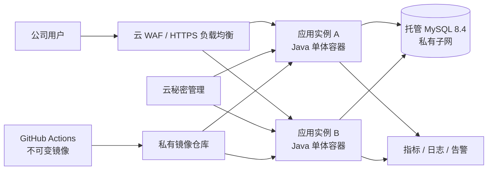

# 临床研发管理平台云上安全运维方案 V1.0

## 1. 结论与推荐拓扑

当前阶段不需要微服务，也不建议一开始使用 Kubernetes。推荐“一个应用镜像 + 托管 MySQL + 云负载均衡 + 云监控/日志”的模块化单体。应用可以横向运行 2 个完全相同的实例，Session 已存数据库，因此不会依赖负载均衡粘性会话。

如果云厂商有成熟的容器服务（如 ECS/Fargate 类托管容器），优先用托管容器而非自己维护 Docker 主机。数据库优先托管 MySQL；只有明确的合规或成本原因才自建数据库主机。

## 2. 服务器与网络选择

### 2.1 建议规格

| 环境 | 应用计算 | 数据库 | 适用范围 |
|---|---:|---:|---|
| 开发 | 1 台 2 vCPU / 4 GB | 单实例 2 vCPU / 4 GB | 团队联调，不承载真实敏感数据 |
| 试运行 | 2 台 2 vCPU / 4 GB | 托管 MySQL 4 vCPU / 8 GB、100 GB SSD | 约 50–200 个内部用户 |
| 正式生产 | 2 台起，2–4 vCPU / 4–8 GB | 托管高可用 MySQL，4 vCPU / 8–16 GB 起 | 按压测和监控结果扩容 |

规格是起点，不是容量承诺。上线前用接近真实数据量完成 50–100 并发用户的压测；当 CPU 连续 15 分钟超过 70%、JVM 堆超过 75% 或数据库连接池经常等待时扩容。

### 2.2 网络边界

- 负载均衡器是唯一公网入口，只开放 443；80 仅做 HTTPS 跳转。
- 应用实例在私有子网，安全组只允许负载均衡访问 8080。
- MySQL 不配置公网 IP，只允许应用安全组访问 3306。
- 管理端口 9090 只允许监控系统访问，不经公网负载均衡。
- 运维不开放全网 SSH。优先使用云会话管理/堡垒机；必须使用 SSH 时限定公司 VPN 出口、密钥登录、关闭密码和 root 登录。
- 对外出口采用白名单或 NAT 网关，记录流量日志。

## 3. 环境与部署

### 3.1 环境隔离

开发、测试、生产至少使用不同的云账号或项目、VPC、数据库、域名、密钥和镜像部署权限。任何环境都不得共用生产数据库账号。测试环境使用脱敏或合成数据。

### 3.2 镜像与运行时

- CI 根据 Git commit 构建一次镜像；测试通过后提升同一个 digest，禁止在服务器重新编译。
- 容器以 UID 10001 非 root 运行，根文件系统只读，仅 `/tmp` 使用受限 tmpfs。
- 配置 JVM `MaxRAMPercentage=75`，给容器本身、线程栈和本地内存留余量。
- 镜像和基础镜像至少每月扫描，发现高危可利用漏洞后 72 小时内修复。
- 生产镜像只允许来自私有仓库，并通过 digest 部署，例如 `image@sha256:...`。

### 3.3 秘密与证书

Git、镜像、Compose 文件和日志中都不得保存数据库密码、引导密码、TLS 私钥。生产环境从云秘密管理服务注入；运行身份只可读取本服务所需的秘密。数据库应用账号只授予该 schema 的 DML 和迁移所需权限，日常运行与 DBA 管理账号分离。

TLS 证书由云证书服务托管并自动续期。启用 TLS 1.2+、HSTS；设置 `SESSION_COOKIE_SECURE=true`。引导管理员创建成功后立即从环境中删除引导密码。

## 4. CI/CD

仓库已提供两个工作流：

- `ci.yml`：每次 Pull Request 和 main 更新执行独立前端构建、Java 测试、
  模块边界检查与旧原型回归。
- `release.yml`：推送 `v*` 标签时构建一次镜像，生成 SBOM/provenance，发布到 GHCR，并保存镜像 digest。

建议发布流程：

1. 功能分支提交 Pull Request；至少 1 人评审，CI 全绿后合并。
2. 依赖扫描、秘密扫描和镜像漏洞扫描作为合并/发布门禁（可用 GitHub Dependabot、CodeQL、Trivy）。
3. 创建语义化标签，例如 `v0.1.0`，发布工作流生成不可变镜像。
4. 测试环境自动部署该 digest，执行数据库迁移和 API 冒烟。
5. GitHub `production` Environment 配置审批人；审批后才允许生产部署。
6. 生产采用两实例滚动发布：先替换一个，readiness 通过且错误率正常 10 分钟后替换另一个。
7. 记录发布人、digest、Flyway 版本、开始/结束时间和验证结果。

云厂商确定后，部署身份应使用 GitHub OIDC 换取短期凭据，不保存长期云 Access Key。当前仓库没有写死某家云的部署脚本，避免引入不安全且不可验证的 SSH 自动发布。

### 4.1 回滚原则

应用回滚是把负载均衡流量切回上一个健康 digest。数据库迁移采用“向前兼容”：先加表/列，再发新代码，确认稳定后另一个版本才删除旧结构。不要把自动 `flyway undo` 当生产回滚。破坏性迁移必须有备份、演练和单独审批。

## 5. 服务监控与告警

应用提供：

- `/actuator/health/liveness`：进程是否存活；失败才重启容器。
- `/actuator/health/readiness`：是否可以接收流量；失败从负载均衡摘除。
- `/actuator/prometheus`：HTTP、JVM、连接池等指标，只允许内网 Prometheus 访问。
- `/actuator/flyway`：数据库版本，仅运维内网访问。

最小仪表盘：请求量、P50/P95/P99 延迟、4xx/5xx 比例、在线实例、JVM 堆/GC/线程、Hikari 连接池、MySQL CPU/磁盘/连接数/慢查询、磁盘备份状态。

最小告警：

| 告警 | 阈值 | 级别 | 首要动作 |
|---|---|---|---|
| 服务不可达 | 连续 2 分钟 | P1 | 摘除异常实例，检查最近发布 |
| 5xx 比例 | 10 分钟 > 5% | P2 | 查错误日志/DB，必要时回滚 |
| P95 延迟 | 10 分钟 > 2 秒 | P2 | 查慢 SQL、连接池和资源 |
| JVM 堆 | 15 分钟 > 85% | P2 | 取堆/GC 证据后扩容或修复 |
| MySQL 存储 | > 80% | P2 | 扩容并检查异常增长 |
| 备份失败 | 任一次 | P1 | 当天修复并补做备份 |

日志输出 JSON 到标准输出，由云日志服务收集。每个请求后续应增加 request ID；日志不记录密码、Session、CSRF token、完整请求体和患者个人信息。保留期按公司数据制度确定，开发默认 14 天、生产建议 90–180 天。

## 6. 动态配置设计

配置分两类，不引入配置中心：

### 6.1 基础设施配置（改后重启）

数据库地址/凭据、端口、Cookie Secure、连接池、JVM 参数属于部署配置，通过环境变量或云秘密管理提供。修改后走正式发布或受控重启，不允许业务管理员在线修改。

### 6.2 业务配置（在线生效）

当前 MVP 将平台名称存入 `plt_system_setting`，后续业务参数也只能通过数据库迁移加入明确白名单。管理员通过 `/api/v1/platform/settings` 修改，服务每次读取数据库，因此立即生效。表中记录 `updated_by` 和 `updated_at`；密码、密钥和数据库地址禁止进入该表。

当前 MVP 数据量小，直接读库比引入缓存更可靠。配置读取成为性能热点后，可增加 30–60 秒本地缓存，并在更新成功后主动失效；仍不需要 Spring Cloud Config 或微服务配置中心。

生产增强项：新增 `plt_system_setting_history` 保存每次变更前后值、操作者、时间和原因，形成不可覆盖的审计记录；对高风险配置采用双人审批。

## 7. 数据库、备份与恢复

- MySQL 使用 8.4 LTS、utf8mb4、UTC 或统一的 `Asia/Shanghai` 策略；应用时间字段保留微秒精度。
- 开启每日全量自动备份与 binlog 时间点恢复（PITR），生产建议保留 35 天；跨区域保留每周备份 3 个月。
- 数据库启用静态加密，连接启用 TLS；备份使用独立 KMS 密钥加密。
- 每季度在隔离环境做一次真实恢复演练。仅“备份成功”不代表可恢复。
- 初始建议 RPO ≤ 15 分钟、RTO ≤ 2 小时；业务确认后再调整。RPO 是最多可接受丢失的数据时间，RTO 是恢复服务最多允许花费的时间。

恢复步骤：冻结写入 → 确认目标时间 → 恢复新实例 → 校验 Flyway 与关键表数量 → 应用只读验证 → 切换连接 → 业务抽检 → 恢复写入。禁止直接覆盖唯一的生产数据库实例。

## 8. 安全运维检查表

### 上线前

- [ ] 域名、证书、WAF、私有子网和安全组完成复核
- [ ] 生产秘密来自秘密管理服务，仓库秘密扫描无发现
- [ ] `SESSION_COOKIE_SECURE=true`，MySQL 与 9090 无公网入口
- [ ] CI、依赖/镜像扫描、生产审批已启用
- [ ] 自动备份和 PITR 已开启，完成一次恢复演练
- [ ] 仪表盘与 P1/P2 通知渠道完成测试
- [ ] 首个管理员密码由安全渠道交付，首次登录后移除引导密码
- [ ] 完成容量测试、安全测试和回滚演练

### 日常

- 每日：检查 P1/P2 告警、备份结果、异常登录和发布记录。
- 每周：检查资源趋势、慢 SQL、失败登录、管理员账号和配置变更。
- 每月：升级基础镜像/依赖、扫描漏洞、复核云 IAM 与安全组、抽查恢复点。
- 每季度：恢复演练、故障演练、账号权限复核、RPO/RTO 复核。

## 9. 当前风险与后续优先级

| 风险 | 当前控制 | 下一步 |
|---|---|---|
| 自建账号遭撞库/暴力破解 | Argon2、统一错误信息、Session/CSRF | 增加登录限流、失败锁定、MFA |
| 动态配置误操作 | 仅管理员、记录更新人和时间 | 增加历史表、变更原因与双人审批 |
| 单数据库故障 | 建议托管高可用、备份/PITR | 上线前完成恢复演练 |
| 单实例发布中断 | Session 外置，可运行双实例 | 生产至少双实例滚动发布 |
| 医药研发数据敏感 | 私网、最小权限、日志脱敏 | 完成数据分类分级和审计策略 |
| MVP 权限粒度较粗 | ADMIN/USER 两角色 | 随月报、风险等模块增加项目级权限 |

本方案是工程安全基线，不替代公司信息安全、数据合规和药企计算机化系统验证要求。若系统未来承载受试者数据、电子签名或用于 GxP 决策，需要再进行数据分类、隐私影响评估、审计追踪与验证范围评估。
