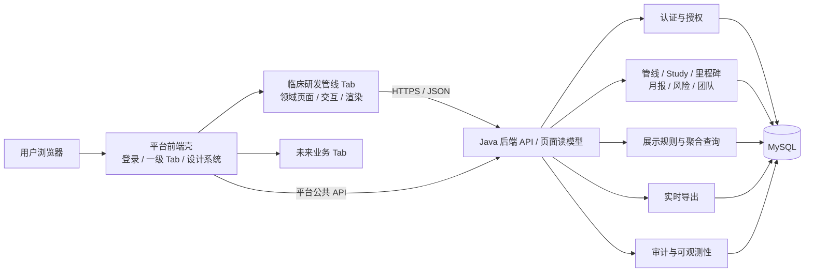
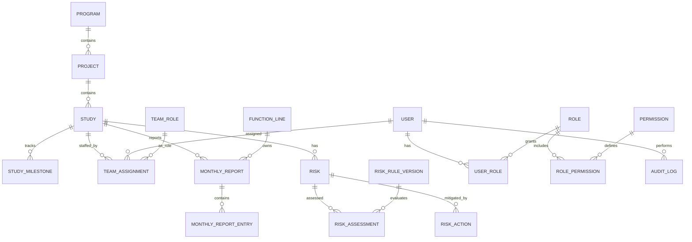

# 临床研发管线管理系统前后端拆分技术设计

> 当前实现快照（2026-07-22）：前端已确定并实现为 Vue 3 + TypeScript + Vue Router +
> Vite，使用 `/pipeline`、`/studies`、`/config`、`/accounts`、`/roles` 等扁平路由；
> Java、Flyway、MyBatis-Plus Repository 和 Spring Session 已统一接入 `hd_plt_*`。
> 本文其余内容同时保留目标架构；尚未落地的月报、风险、团队、里程碑和导出不得视为当前能力。

> 文档版本：V1.3
> 日期：2026-07-20
> 状态：待评审  
> 依据：当前工作区的 `管线总览 Coverpage.dc.html`、页面测试及《临床研发管线管理系统 PRD V1.0》  
> 目标：前端仅负责交互与数据渲染；数据、权限、字段展示口径、聚合计算、导出和审计由后端负责。

## 1. 结论摘要

本系统建议从“浏览器内单体原型”拆为“平台前端壳 + 临床研发管线业务 Tab + Java 模块化单体后端 + MySQL”的结构。当前 HTML 不是未来平台本身，而是平台中的一个业务 Tab。第一期后端不拆微服务、前端不直接上微前端：先建立清晰模块契约和路由级懒加载，在团队所有权或独立发布需求出现后再演进，避免过早引入分布式复杂度。

拆分后的关键边界如下：

- 前端保留：页面布局、组件、弹窗、输入过程状态、加载/空态、分页交互、拖拽手势、颜色 token 到 CSS 的映射。
- 后端接管：身份认证、数据权限、字段可见性、枚举与字段元数据、搜索筛选排序、阶段回填、里程碑状态、风险评分、月报完成率、Project 聚合、导出、备份恢复和审计日志。
- 后端返回“可展示但不带 CSS 的页面读模型”：包括字段定义、格式化文本、语义状态、操作权限和计算说明。前端不再复制业务公式，也不能用隐藏按钮代替后端鉴权。
- 所有写操作使用稳定 ID、服务端校验、事务和审计；不再按姓名推导关联，不再保存明文密码，不再把业务数据放在 `localStorage`。
- 平台壳统一负责登录会话、一级 Tab、用户上下文、设计系统、通知、异常边界和埋点；临床研发管线模块只负责本领域的二级页面和数据交互。
- 当前原型中的“账号管理”上移为平台管理能力，不继续内嵌在临床研发管线 Tab 中；管线模块只消费平台下发的用户、权限码和数据范围。
- 当前没有既有平台壳，因此一期必须同时交付最小可用平台壳、平台管理模块和临床研发管线 Tab，而不是等待外部平台项目。
- 不迁移当前 HTML/`localStorage` 中的演示数据和账号；新系统从空库、正式字典及首个管理员账号开始初始化，原型数据只作为测试样例。
- 登录采用自建账号：Spring Security + 服务端 Session + 安全 Cookie；密码使用 Argon2id 单向哈希，浏览器不保存认证 token。
- MySQL 由本项目独立建设和维护，不接入或共用其他业务系统实例；开发、测试、生产环境分别使用独立数据库和最小权限账号。



## 2. 当前实现盘点

### 2.1 当前页面与业务模块

现有 HTML 包含 9 个入口：管线总览、Study 列表、研究月度汇报、风险管理、团队矩阵、管线配置、月报导出、账号管理、里程碑。平台化后，账号管理上移至平台管理模块，其余 8 个领域入口留在“临床研发管线”Tab 内。核心业务层级是 `Program -> Project -> Study`，其中 Study 是里程碑、团队、月报和风险的主要明细单元。

医药术语简释：

- Program：项目集，通常围绕同一产品或研发方向组织多个项目。
- Project：产品在某个适应症上的研发项目；“适应症”即药物拟预防、诊断或治疗的疾病/状态。
- Study：一项临床研究，是本系统的主要执行和跟踪单元。
- PreIND / IND：IND 前沟通 / 临床试验申请；IND 获准后，药物才可按批准方案进入临床研究。
- FPI、LPI、LPO：首例受试者入组、末例受试者入组、末例受试者完成末次访视。
- DBL / CSR：数据库锁定 / 临床研究报告。

### 2.2 当前浏览器持久化数据

| 现有存储键 | 当前内容 | 后端目标对象 |
|---|---|---|
| `coverpage-auth-v3` | 当前登录会话 | 不迁移；新系统使用 Spring Security 服务端 Session |
| `coverpage-accounts-v3` | 账号、角色、明文演示密码 | 不迁移；新建平台用户，密码仅保存 Argon2id 哈希 |
| `coverpage-risks-v2` | 风险及扁平措施字段 | 不迁移；新数据写入 `risks`、`risk_actions`、`risk_assessments` |
| `coverpage-config-v2` | Program/Project/Study 配置 | 不迁移；正式数据在新系统录入或通过后续标准导入模板初始化 |
| `coverpage-monthly-v2` | Study×功能线×月份文本 | 不迁移；新数据写入 `monthly_reports` |
| `coverpage-team-v3` | `Study||Role -> 姓名字符串` | 不迁移；新团队分配关联平台 `user_id` |
| `coverpage-msedit-v2` | `Study|阶段-节点 -> 日期/备注` | 不迁移；新数据写入 `hd_plt_study_milestone` |
| `coverpage-order-v2` | TA 下 Project 排序 | 不迁移；新系统按明确的全局/个人排序口径创建 |
| `coverpage-overrides-v2` | 阶段状态人工覆盖 | 不迁移；新覆盖必须记录原因、有效期和审计 |

### 2.3 必须迁出前端的现有逻辑

| 当前逻辑 | 当前证据/行为 | 后端归属 |
|---|---|---|
| 数据范围 | 根据团队矩阵姓名计算可见 Study，PL/PM 扩展到同 Project | AuthorizationService；改用 `user_id` 和显式 Scope |
| 部门编辑权 | Study 角色映射为功能线，决定月报可编辑部门 | AuthorizationService + TeamService |
| Project 聚合 | Study 筛选后按 Project 去重生成总览行 | PipelineQueryService |
| 阶段状态 | Phase Status、里程碑和覆盖值共同推导状态 | StageProjectionService |
| 阶段回填 | 后续阶段存在时，前序空阶段显示“已完成/由后续阶段回填” | StageProjectionService，并返回回填来源 |
| 当前里程碑 | 根据 Actual Start/End 顺序推导当前节点 | MilestoneService |
| 月报完成率 | 应填功能线、已填写功能线和整体完成率 | MonthlyReportQueryService |
| 风险评分 | `影响×可能性×可探测性`，1~125，阈值分级 | RiskService + 版本化评分规则 |
| 风险编号 | 浏览器扫描最大编号再加 1 | MySQL 编号生成表/后端编号服务；事务内加锁分配 |
| 最近更新 | 当前为部分演示值 | 统一根据业务表 `updated_at` 聚合 |
| 导出 | 浏览器拼接 HTML/CSV/Excel | ExportService，按请求人权限生成 |
| 账号与备份 | 浏览器保存账号、密码和全量 JSON | Identity/AdminService；禁止导出密码 |

## 3. 目标架构与设计原则

### 3.1 架构选择

技术基线确定为：

| 层 | 建议 | 理由 |
|---|---|---|
| 前端平台 | Vue 3 + TypeScript + Vue Router + Vite | 平台壳、路由守卫和共享视觉样式 |
| 当前业务模块 | `clinical-pipeline` 路由模块 | 承载当前原型的管线、Study、月报、风险、团队、配置、导出和里程碑页面 |
| 后端 | Java + Spring Boot 3.x | 统一事务、鉴权、审计、批任务和 OpenAPI；采用分层模块化单体 |
| 数据访问 | MyBatis-Plus（仅限 Repository 适配层） | Domain/Manager 不依赖 ORM；复杂读模型可使用参数化显式 SQL |
| API | REST/JSON，前缀 `/api/v1` | 平台公共 API 与临床管线 API 分命名空间，便于未来增加其他 Tab |
| 数据库 | 项目独立 MySQL 8.x，InnoDB，`utf8mb4` | 独立实例、独立账号、独立备份；不接入其他业务系统数据库 |
| 缓存 | 第一阶段非必需；性能证据出现后引入 Redis | 避免过早增加一致性和运维成本 |
| 文件 | HTTP流式响应 | 导出实时查询和生成，不预生成文件、不把文件放入数据库 |
| 部署 | 平台前端静态站点 + Java 单服务 + MySQL | 第一阶段统一发布，保留按模块拆分能力 |

后端采用 Java 模块化单体。平台公共模块包括 `identity`、`authorization`、`platform-navigation`、`audit`；临床研发管线模块包括 `pipeline`、`study`、`milestone`、`team`、`monthly-report`、`risk`、`export`。模块间只通过 Java 服务接口和稳定 ID 协作，不允许跨模块直接修改对方表。平台公共表和临床管线表位于本项目独立 MySQL 数据库内，以表前缀和 Java 包边界区分所有权，不与其他系统共享实例或业务账号。

### 3.2 平台壳与业务 Tab 边界

平台采用两级导航：一级是平台 Tab，当前模块注册为“临床研发管线”；二级是该 Tab 内的管线总览、Study 列表、月度汇报、风险管理、团队矩阵、管线配置、月报导出和里程碑。账号管理不再作为二级页面，迁移到平台管理 Tab。

由于平台壳尚不存在，一期平台壳不是抽象依赖，而是本项目的明确交付物。最小范围包括：登录页、应用框架、一级 Tab、路由、面包屑、用户菜单、403/404/500 页面、全局加载与通知、平台管理入口、设计 token、统一 API 客户端和错误边界。首页工作台、跨模块搜索、消息中心、流程引擎等不属于一期，避免把“搭平台壳”扩张为建设完整门户。

平台壳统一提供：

- 登录会话、当前用户、退出和会话过期处理。
- 一级 Tab 注册、权限过滤、路由和面包屑。
- 设计 token、通用组件、国际化、全局通知、错误边界和埋点。
- HTTP 客户端、`requestId`、401/403/409 统一处理和前端 API 类型。
- Tab 的加载、卸载、缓存和异常隔离。

临床研发管线 Tab 负责：

- 本领域二级路由、页面组件、表格、筛选器、抽屉和表单。
- 只调用 `/api/v1/clinical-pipeline/**` 领域 API，并消费平台提供的用户上下文。
- 不自行实现登录、一级导航、账号角色管理、全局主题或第二套 HTTP 客户端。

前端模块契约示意：

```ts
export interface PlatformTabModule {
  id: 'clinical-pipeline';
  title: '临床研发管线';
  route: '/pipeline' | '/studies' | '/monthly' | '/risks' | '/team' | '/config' | '/reports';
  requiredPermission: 'clinical_pipeline.tab.view';
  load: () => Promise<{ default: Component }>;
}
```

第一期在同一前端仓库内通过动态 `import()` 实现路由级懒加载。只有同时满足下列条件时才升级为微前端：存在独立负责团队、需要独立发布节奏、共享依赖契约已稳定、平台具备版本治理和故障隔离能力。不能仅因“未来是平台”就提前引入多运行时和多套依赖。

建议目录边界：

```text
apps/platform-web/
  src/shell/                         # 平台壳、一级 Tab、路由
  src/modules/clinical-pipeline/     # 当前业务 Tab
    pages/                           # 领域二级页面
    components/                      # 领域组件
    queries/                         # 服务端状态查询
    routes.tsx
    module.ts
packages/
  design-system/                     # 平台视觉和无障碍组件
  platform-contracts/                # Tab、用户、权限、错误契约
  api-client/                        # 统一 HTTP 基础设施
```

### 3.3 “后端吃掉字段展示逻辑”的准确边界

后端负责返回页面所需的展示模型，例如：

```json
{
  "key": "indStatus",
  "label": "IND",
  "value": "SUBMITTED",
  "displayText": "已递交",
  "semantic": "INFO",
  "isApplicable": true,
  "isBackfilled": false,
  "explanation": "来自 IND 递交里程碑的实际开始日期",
  "actions": ["VIEW_MILESTONE"]
}
```

字段含义：`value` 是稳定机器值；`displayText` 和 `explanation` 是后端口径；`semantic` 只能取 `NEUTRAL/INFO/SUCCESS/WARNING/DANGER/MUTED`，由前端映射为设计系统颜色。后端不得返回 `#1E5ED6`、CSS 类名、像素或 DOM 片段。

后端还返回 `meta.columns`、枚举字典、字段可见性和操作权限，使同一权限判断不在多个页面重复。前端仍决定表格/卡片/抽屉布局，并可在不改变业务含义的前提下响应式排版。

### 3.4 读写模型分离

- 命令 API 面向稳定领域资源，例如 `POST /risks`、`PATCH /studies/{id}`。
- 页面查询 API 面向当前 UI，例如 `GET /pipeline-overview`、`GET /monthly-reporting`，返回已聚合的读模型。
- 查询 API 不能直接接受任意 SQL 字段名；`sortBy`、`filter` 必须使用服务端白名单。
- 所有列表均服务端分页；总览页可按 TA 分组分页或游标分页。
- 查询和导出必须复用同一权限范围与业务口径，禁止“页面看不到但导出能拿到”。

## 4. 前后端职责矩阵

| 能力 | 前端 | 后端 |
|---|---|---|
| 登录表单 | 平台壳收集输入、处理加载态和错误展示；业务 Tab 不实现登录 | 平台认证模块负责会话、失败限流、账号状态 |
| 一级 Tab 导航 | 平台壳根据模块清单渲染、懒加载和隔离异常 | 平台模块计算 Tab 可见性与权限 |
| 管线二级页面 | 临床管线模块负责二级路由、选中状态和页面切换 | 返回二级页面权限与字段能力 |
| 搜索/筛选 | 维护临时条件、防抖、发起请求 | 数据范围、筛选、排序、分页、计数 |
| 字段展示 | 根据 `meta + rows` 渲染 | 字段标签、可见性、格式化文本、枚举、计算说明 |
| 管线阶段 | 展示阶段格、tooltip | 阶段映射、回填、状态语义、异常检测 |
| 表单 | 输入控件、客户端即时提示 | 权威校验、权限、事务、审计 |
| 风险 | 录入评分因子、展示结果 | 计算总分/等级、规则版本、编号生成 |
| 月报 | 编辑体验、字符计数 | 应填部门、完成率、唯一性、权限 |
| 团队 | 矩阵交互 | 成员/角色有效性、Project 管理范围 |
| 导出 | 选择格式并接收下载 | 按当前权限实时查询、流式生成和审计 |
| 并发冲突 | 提示用户刷新后重试 | 事务和更新条件校验；当前物理模型不保存通用version字段 |
| 审计 | 可选展示审计记录 | 记录谁在何时改了什么、前后值和请求 ID |
| 账号与角色 | 平台管理 Tab 负责交互；临床管线模块只展示成员引用 | 平台 Identity/Authorization 模块维护账号、角色和数据范围 |

## 5. API 统一规范

### 5.1 基础约定

- API 总前缀：`/api/v1`
- 平台公共 API：`/api/v1/platform/**`，用于会话、Tab 清单、账号、角色和平台审计。
- 临床研发管线 API：`/api/v1/clinical-pipeline/**`。下文领域端点如 `/studies` 均相对此模块前缀，即完整路径为 `/api/v1/clinical-pipeline/studies`。
- JSON 字段使用 `camelCase`；枚举值使用 `UPPER_SNAKE_CASE`。
- API使用数据库BIGINT主键作为资源ID；Study No.、Risk No.等业务编号单独设唯一约束。
- 时间：时间点用 ISO 8601 UTC，如 `2026-07-16T08:00:00Z`；业务日期用 `YYYY-MM-DD`；月份用 `YYYY-MM`。
- 列表默认 `page=1&pageSize=20`，`pageSize` 最大200；导出复用相同查询口径并实时生成。
- `PATCH` 仅修改提交字段；服务端在事务内校验当前状态和归属关系。
- 删除默认软删除或状态关闭；确需物理删除的管理动作必须二次确认和审计。
- 需要防重的写请求支持 `Idempotency-Key`，避免网络重试造成重复写入；实时导出为只读查询，不创建导出任务记录。

### 5.2 通用响应

成功列表：

```json
{
  "data": [],
  "meta": {"columns": [], "dictionaries": {}},
  "pagination": {"page": 1, "pageSize": 20, "totalItems": 0, "totalPages": 0},
  "requestId": "req_01..."
}
```

统一错误：

```json
{
  "error": {
    "code": "VERSION_CONFLICT",
    "message": "数据已被其他用户更新，请刷新后重试",
    "details": {"currentVersion": 8}
  },
  "requestId": "req_01..."
}
```

| HTTP | 语义 |
|---:|---|
| 400 | 请求格式错误、非法筛选或排序字段 |
| 401 | 未登录或会话失效 |
| 403 | 已登录但无权查看/操作该资源 |
| 404 | 资源不存在或为防止越权而隐藏 |
| 409 | 唯一键冲突或业务状态冲突 |
| 422 | 字段语义校验失败 |
| 429 | 请求过多 |
| 500 | 服务端错误；不得暴露堆栈和 SQL |

### 5.3 平台公共 API

| 方法与路径 | 用途 | 关键结果 |
|---|---|---|
| `GET /api/v1/platform/auth/csrf` | 获取 SPA 的 CSRF token | 返回 token/header 名称；前端仅保存在内存并随写请求提交 |
| `POST /api/v1/platform/auth/login` | 自建账号登录 | 成功后轮换 Session ID，并设置 `HttpOnly` 会话 Cookie |
| `POST /api/v1/platform/auth/logout` | 退出登录 | 注销服务端 Session、清除 Cookie；必须使用 POST 和 CSRF |
| `GET /api/v1/platform/me` | 当前平台用户上下文 | 用户、角色摘要、权限码、数据范围摘要 |
| `GET /api/v1/platform/tabs` | 获取可见一级 Tab | `id,title,route,icon,requiredPermission,order`；仅返回当前用户可见项 |
| `GET /api/v1/platform/navigation` | 获取平台导航及管理入口 | 一级 Tab、平台管理菜单、面包屑元数据 |
| `GET /api/v1/platform/users` | 平台账号管理 | 分页用户列表；不返回密码哈希 |
| `GET /api/v1/platform/roles` | 平台角色与权限模板 | 角色、权限码和 `ALL/ASSIGNED_STUDY` 范围模式 |
| `POST /api/v1/platform/users` | 新建平台用户 | 触发账号激活或临时密码流程 |
| `PATCH /api/v1/platform/users/{id}` | 修改平台用户 | 显示姓名、状态等；登录邮箱不可修改 |
| `DELETE /api/v1/platform/users/{id}` | 停用平台用户 | 软删除；已产生业务记录的用户不可物理删除 |
| `POST /api/v1/platform/me/password` | 当前用户修改密码 | 校验原密码、撤销其他 Session、记录安全审计 |
| `POST /api/v1/platform/users/{id}/password-reset-tokens` | 管理员发起密码重置 | 生成一次性、短时效、仅保存哈希的激活 token；不得返回现有密码 |
| `POST /api/v1/platform/auth/password-reset` | 使用一次性 token 设置新密码 | 成功后 token 失效、轮换安全戳并撤销既有 Session |
| `PUT /api/v1/platform/users/{id}/roles` | 分配平台角色 | 统一影响各业务 Tab 的权限模板 |
| `GET /api/v1/platform/audit-logs` | 平台审计查询 | 按对象、人员、模块和时间查询 |

平台壳只依赖平台公共 API；业务 Tab 不允许直接维护会话和账号。平台下发的前端权限仅用于控制交互可见性，临床管线后端仍必须对每个请求重新鉴权。

### 5.4 临床管线页面查询 API

| 方法与路径 | 用途 | 关键参数/结果 |
|---|---|---|
| `GET /ui/bootstrap` | 当前 Tab 公共元数据 | TA、阶段、功能线、风险规则摘要、可见二级页面 |
| `GET /pipeline-overview` | 管线总览读模型 | `q, taId, programId, stage, status, quickFilter, page, pageSize`；返回卡片、TA 分组、Project 行和阶段单元格 |
| `GET /studies` | Study 列表 | `q, taId, programId, stage, status, sortBy, sortOrder` |
| `GET /studies/{studyId}` | Study 抽屉/详情 | 返回基础信息、权限动作和关联摘要 |
| `GET /monthly-reporting` | 月度填报页 | `month, q, taId, programId`；返回应填数、已填数、完成率和 Study 行 |
| `GET /risks` | 风险登记册 | `q, functionCode, status, severity, studyId, sortBy` |
| `GET /team-matrix` | 团队矩阵读模型 | `studyQuery, roleQuery, page, pageSize`；需 `team.page.view`；返回当前页 Study、角色和成员分配 |
| `GET /studies/{studyId}/team` | Study 抽屉团队只读 | 需 `study.read` + Study 数据范围；**不要求** `team.page.view`；返回该 Study 的角色与成员 |
| `GET /pipeline-config` | 管线配置页 | 以 Study 为粒度返回 Program/Project/Study 扁平明细，不返回 Project 状态 |
| `GET /programs`、`GET /projects` | 管线配置实体选择 | 按编码查询真实实体；Program/Project 不维护名称字段 |
| `GET /therapeutic-areas` | Project 表单字典 | 返回数据库中启用的 TA，按 `sort_order` 排序 |
| `GET /reports/monthly/preview` | 月报预览 | `month, studyIds?`；返回与导出同口径的报告模型 |
| `GET /studies/{studyId}/milestones` | 里程碑页 | 需 `milestone.read`；返回阶段组、节点、计划版本、实际日期和活动状态 |

`GET /pipeline-overview` 的核心返回示例：

```json
{
  "data": {
    "summary": {"projectCount": 12, "openRiskCount": 5, "attentionCount": 3, "approvedCount": 4, "updatedThisMonthCount": 7},
    "groups": [{
      "ta": {"code": "ONCOLOGY", "displayText": "肿瘤"},
      "projectCount": 4,
      "rows": [{
        "projectId": "01J...",
        "product": "HDM-001",
        "program": {"id": "01J...", "displayText": "HDM1005"},
        "indications": ["2型糖尿病"],
        "leads": [{"userId": "01J...", "displayName": "张伟"}],
        "hasUpdateThisMonth": true,
        "projectStatus": {"value": "IN_PROGRESS", "displayText": "进行中", "semantic": "INFO"},
        "stages": [{"key": "IND", "displayText": "已递交", "semantic": "INFO", "isBackfilled": false, "explanation": "来自实际开始日期"}],
        "actions": ["VIEW_STUDY", "VIEW_MILESTONE"]
      }]
    }]
  },
  "meta": {"columns": [], "availableFilters": {}},
  "pagination": {"page": 1, "pageSize": 20, "totalItems": 12, "totalPages": 1}
}
```

### 5.5 临床管线领域写 API

#### Study 与管线配置

| 方法与路径 | 权限 | 说明 |
|---|---|---|
| `GET /pipeline-config` | `config.page.view` | Study 粒度的配置明细 |
| `GET /programs`、`GET /projects` | `config.page.view` | 查询实体；Project 可按 Program 过滤 |
| `GET /therapeutic-areas` | `config.page.view` | 查询启用的 TA 下拉选项 |
| `POST /programs` | `config.create` | 新建 Program；填写 Program Code、Source、Origin、Product、MOA |
| `PATCH /programs/{id}` | `config.update` | 修改 Source、Origin、Product、MOA；Program Code 不可修改 |
| `DELETE /programs/{id}` | `config.delete` | 有 Project/Study 引用时返回 409 |
| `POST /projects` | `config.create` | 在指定 Program 下新建 Project；填写 Project Code、TA、Indication |
| `PATCH /projects/{id}` | `config.update` | 修改 TA、Indication；所属 Program 和 Project Code 创建后不可修改，Project 状态不落库 |
| `DELETE /projects/{id}` | `config.delete` | 有 Study 引用时返回 409 |
| `POST /studies` | `config.create` | 按 `projectId` 新建 Study；校验 Study No. 唯一 |
| `PATCH /studies/{id}` | `config.update` | 修改所属 Project 和 Phase Status；Study No. 不可修改 |
| `DELETE /studies/{id}` | `config.delete` | 有团队、里程碑、月报或风险明细时返回 409 |

管线配置响应不返回 Program、Project、Study 名称或 `phaseStatusLabel`；阶段英文标签由前端根据 `phaseStatus` 映射。本期不建设实体合并工具，也不修改既有排序规则。

#### 里程碑

| 方法与路径 | 权限 | 说明 |
|---|---|---|
| `GET /studies/{id}/milestones` | `milestone.read` | 查询阶段组、节点、计划/实际日期与节点状态 |
| `PUT /studies/{id}/milestones/{milestoneCode}` | `milestone.update` | 保存V1/V2计划日期、实际开始/结束和偏差说明 |
| `GET /studies/{id}/stage-projection` | `milestone.read` | 返回当前阶段、活动节点及推导证据 |

里程碑更新校验：`actualEnd >= actualStart`；后续节点实际日期不得早于前序已完成节点，除非使用有理由且可审计的例外流程；所有日期变更记录旧值、新值和更新人。

#### 月度汇报

| 方法与路径 | 权限 | 说明 |
|---|---|---|
| `GET /studies/{id}/monthly-reports?month=2026-07` | `monthly.read` | 查询Study当月应填功能线及多条进展 |
| `POST /monthly-reports/{id}/entries` | `monthly.create` | 为一个月报应填项新增一条独立进展 |
| `PATCH /monthly-report-entries/{entryId}` | `monthly.update` | 修改指定进展明细，不覆盖其他汇报 |

请求体示例：

```json
{"entryDate":"2026-07-20","content":"本月新增入组 42 例……"}
```

月报没有提交、审核、退回或批准状态。

#### 风险

| 方法与路径 | 权限 | 说明 |
|---|---|---|
| `POST /risks` | `risk.create` + Study可见范围 | 服务端生成风险编号、评分和等级 |
| `GET /risks/{id}` | `risk.read` | 风险详情、措施、评分历史 |
| `PATCH /risks/{id}` | `risk.update` | 更新描述、Owner、状态等；带版本 |
| `POST /risks/{id}/assessments` | `risk.assess` | 新增一次评分，保留历史和规则版本 |
| `POST /risks/{id}/actions` | `risk.action.create` | 新增独立控制措施 |
| `PATCH /risk-actions/{actionId}` | `risk.action.update` | 更新措施责任人、计划/实际完成日 |
| `POST /risks/{id}/close` | `risk.close` | 关闭风险；校验关闭原因和必要措施 |
| `DELETE /risks/{id}` | `risk.delete` | 仅允许删除误建且未形成后续记录的风险；其他情况必须关闭 |

服务端评分：`score = impact × likelihood × detectability`。当前原型阈值为低风险 1~12、中风险 13~36、高危 ≥37；正式上线前需业务签字确认，并在风险评估中保存 `rule_version_id`，以便历史风险按当时规则重现。

#### 团队与平台用户引用

| 方法与路径 | 权限 | 说明 |
|---|---|---|
| `GET /team-matrix` | `team.page.view` | 团队矩阵整页读模型 |
| `GET /studies/{id}/team` | `study.read` | Study 抽屉团队只读；不要求 `team.page.view` |
| `PUT /team-matrix/assignments` | `team.edit_mode` + `team.update` | 按 Study 版本批量替换角色成员；整批事务处理，版本冲突返回 `409` |

团队分配只提交平台 `userId`。用户搜索、账号维护、角色与权限端点属于 5.3 的平台公共 API；临床管线模块不得提供第二套 `/users` 资源。

#### 导出

| 方法与路径 | 权限 | 说明 |
|---|---|---|
| `GET /reports/monthly/export?month=2026-07&format=xlsx` | 对应 `report.export.*` | 按请求实时查询数据库并流式生成文件，不预生成、不落库 |

整库备份、恢复和服务器迁移由MySQL运维流程完成，不提供页面整库导入或覆盖接口。

## 6. 数据库设计

### 6.1 总体关系



### 6.2 独立数据库建设要求

本项目建设独立 MySQL 数据库，逻辑库名为 `study_management`。开发、测试、生产必须使用不同实例或严格隔离的独立环境，禁止让测试连接生产，也禁止与其他业务系统共用表、root账号或应用账号。

| 项目 | 设计要求 |
|---|---|
| 变更管理 | 统一使用 Flyway；建表、索引、字典和修复脚本全部版本化，生产禁止 Hibernate `ddl-auto=update` |
| 部署账号 | `db_migration` 仅在发布窗口执行 DDL/DML 版本脚本，凭据由部署系统保管 |
| 运行账号 | `app_runtime` 只拥有本库必要的 SELECT/INSERT/UPDATE/DELETE，不授予建库、建用户、DROP DATABASE 等权限 |
| 运维只读账号 | `db_readonly` 只读并限制来源网络，用于受控排障和报表核查 |
| 网络 | MySQL 不暴露公网，只允许 Java 服务、发布任务和受控运维入口访问；跨主机连接启用 TLS |
| 数据保护 | 生产上线前启用自动全量备份、binlog 和时间点恢复能力；备份加密并与数据库实例隔离保存 |
| 恢复验证 | 定期把备份恢复到隔离环境，记录恢复耗时、校验结果和演练人；只生成备份不算具备恢复能力 |
| 监控 | 监控连接数、慢查询、锁等待、CPU、内存、磁盘、binlog、备份新鲜度和恢复演练状态 |
| 密钥 | 数据库密码只存于环境密钥系统/部署系统，不写入源码、Flyway 脚本、日志或前端配置 |

数据库实例由本项目负责版本升级、补丁、容量、备份、恢复和故障响应。生产采用单实例还是高可用架构，应依据最终 RPO、RTO 和可用性目标确定；无论拓扑如何，应用层不得假设数据库永不短暂中断，连接池需配置超时、健康检查和有限重试。

### 6.3 已确认的物理模型

最终数据库结构以[完整PRD数据库设计规格](database/完整PRD数据库设计规格.md)和
[MySQL建表语句及Flyway V1基线](../study-management-service/src/main/resources/db/migration/mysql/V1__hd_plt_full_schema.sql)为唯一依据，共25张表。

- 所有表统一使用 `hd_plt_` 前缀、InnoDB、`utf8mb4_0900_ai_ci`。
- 主键使用 `BIGINT UNSIGNED AUTO_INCREMENT`。
- 业务、配置和关系表统一保存 `sys_create_by`、`sys_update_by`、
  `sys_create_time`、`sys_update_time`、`sys_deleted`。
- 建表语句不使用数据库外键、`CHECK`或命名`CONSTRAINT`；跨表存在性、枚举和日期规则由Java事务校验。
- 邮箱是账号唯一标识；Program、Project、Study业务编码全局唯一且创建后不可修改。

### 6.4 主数据、里程碑和实时状态

- 一个Product对应一个Program；一个Program包含多个Project。
- 一个Project保存一个适应症文本并包含多个Study；适应症不配置化。
- Source、Origin、Phase Status和里程碑节点定义由Java固定映射。
- Study冗余保存常用筛选字段快照，上级名称变化后不自动同步历史Study。
- 里程碑只使用 `hd_plt_study_milestone`，每个Study和固定节点一行，保存V1/V2计划日期和实际日期。
- Project状态不落库，根据下属Study的阶段、里程碑和风险数据实时汇总计算。

### 6.5 团队、权限与数据范围

- 账号、角色、权限通过 `hd_plt_user_role` 和 `hd_plt_role_permission` 关联。
- 不支持用户单独权限覆盖；用户操作权限是所有启用角色权限的并集。
- 角色范围仅为 `ALL` 或 `ASSIGNED_STUDY`。
- `hd_plt_team_assignment` 使用 `study_id + team_role_id + user_id` 关联，团队成员必须来自账号表。
- 团队分配同时决定 `ASSIGNED_STUDY` 用户的Study可见范围；创建立即生效，移除使用逻辑删除，不保存有效起止日期。

### 6.6 月报、风险与导出

- `hd_plt_monthly_report` 保存Study、月份和应填功能线快照，团队变化不改写历史完成率。
- `hd_plt_monthly_report_entry` 保存同月多次独立汇报；不存在提交或审批流程。
- 风险主表保存最新评分，`hd_plt_risk_assessment`保存每次历史评估及当时规则版本。
- 一条风险可关联多条 `hd_plt_risk_action`；Owner和措施责任人必须是对应Study团队成员。
- 导出由请求实时查询数据库生成，不建立导出任务表、不预生成或保存文件。

### 6.7 审计与事务边界

- 关系字段使用内部ID，展示和筛选需要的名称/编码按已确认规则保存快照。
- Java在同一事务中校验归属关系、状态编码、日期先后、团队成员资格和权限。
- `hd_plt_audit_log`只追加，风险关闭/重开/重新评估、权限和团队变更、导出等关键操作写入审计。
- 页面不提供整库JSON导入覆盖；数据库迁移、备份和恢复由运维流程完成。
- 25表脚本已成为正式 Flyway V1 基线，Java 运行时、Repository 和 Spring Session 已完成适配；历史空库建表验证与当前应用集成验证仍应分别记录。

## 7. 关键后端展示规则

### 7.1 管线总览

处理顺序必须固定并有契约测试：

1. 根据当前用户权限获得可见 Study ID 集合。
2. 在可见集合上应用搜索、TA、Program、阶段、状态和快捷筛选。
3. 为每个 Study 计算阶段投影、当前里程碑、风险数和最近更新时间。
4. 按 Project ID 聚合，一项 Project 只返回一行；任一 Study 命中则 Project 命中。
5. 校验同一 Project 的 Product 等本应一致的字段；冲突时返回 `dataQualityIssues`，不得取第一条后静默覆盖。
6. 对 Project、Risk、Study 分别按其 ID 去重统计卡片。

阶段回填必须返回 `isBackfilled=true`、`sourceStage` 和自然语言 `explanation`，以便页面 tooltip 解释“实际无项目，由后续阶段回填”。“未开始”和“不适用”不算进入阶段。

### 7.2 当前里程碑

在阶段组内按节点顺序计算：

- `actualStart`、`actualEnd` 都为空：节点未开始。
- 有 `actualStart` 无 `actualEnd`：该节点进行中。
- 有 `actualEnd` 且不是最后节点：当前活动节点顺延到下一节点。
- 最后节点有 `actualEnd`：阶段组完成。
- 数据矛盾时不猜测，返回 `dataQualityIssues` 并由后台报表跟踪。

### 7.3 月报完成率

- 应填数：当月有效的 Study×功能线要求数。
- 已填数：内容 `trim()` 后非空的要求数。
- Study 完成率：`已填数 / 应填数` 四舍五入为整数；应填数为 0 显示“—”，不参与整体分母。
- 页面整体完成率必须用总已填数/总应填数计算，不能平均各 Study 百分比。

### 7.4 风险评分

- 三因子均为 1~5 的整数；任一缺失时拒绝提交，后端不以 0 代替。
- score 和 severity 均为服务端只读字段。
- 每次重新评分新增 `risk_assessments`，不覆盖历史。
- 阈值版本必须随评估记录保存，规则变更不自动改写历史等级。

## 8. 安全、合规与审计

此系统处理临床研发进度、风险和人员分工，虽然未必直接保存受试者个人信息，仍属于企业敏感研发数据。第一期应明确禁止录入受试者姓名、证件号、联系方式等个人信息；若未来需要处理，必须另行完成隐私影响评估、字段最小化和访问控制设计。

最低安全要求：

- 自建账号使用 Spring Security 和服务端 Session；全站 HTTPS，会话 Cookie 必须为 `HttpOnly + Secure + SameSite=Lax/Strict`，前端不把 session/token 放 `localStorage`。
- 登录成功后轮换 Session ID，修改/重置密码后撤销该用户的其他 Session；配置空闲超时、绝对超时和并发会话上限。
- 所有 POST/PUT/PATCH/DELETE（包括登录和退出）启用 Spring Security CSRF 防护；SPA 从受保护端点获取 token，并通过请求头提交。
- 密码固定使用 Argon2id 单向哈希和每密码独立盐；参数以 OWASP 最低基线为下限，并在目标服务器压测后调整。禁止明文、可逆加密、MD5、SHA-1 或单独 SHA-256。
- 初始密码策略：长度 12~128 字符、允许密码管理器粘贴、拒绝常见/泄露密码；不强制无意义的定期改密，发生泄露、管理员重置或首次登录时强制修改。
- 登录失败采用账号+IP 双维度限流和递增等待，错误文案不区分“账号不存在/密码错误”；连续失败触发临时锁定并记录安全审计。
- 密码重置 token 使用密码学安全随机数，只在数据库保存哈希，短时有效且一次性使用；第一期由管理员发起并通过受控渠道交付，不开放无通知渠道的公网“忘记密码”。
- 每个后端端点同时检查权限码和数据范围；对象级授权不得依赖前端传入的角色。
- 输入使用 schema 白名单验证，SQL 全部参数化，富文本按纯文本处理或严格消毒。
- CORS 仅允许已知前端域名；设置 CSP、HSTS、X-Content-Type-Options 等安全头。
- 登录、导出、备份、批量查询和写接口分别限流；导出限制最大数据量和并发数。
- 错误响应不返回堆栈、SQL、密码哈希或内部路径。
- 审计至少覆盖：登录失败、授权变更、Study/里程碑/月报/风险/团队变更、导出、备份与恢复。
- 审计日志记录业务前后值，但对密码、会话、密钥等字段强制脱敏/排除。
- 数据库备份加密、定期恢复演练；明确 RPO/RTO 后再决定备份频率。

认证设计依据：[OWASP Password Storage Cheat Sheet](https://cheatsheetseries.owasp.org/cheatsheets/Password_Storage_Cheat_Sheet.html)、[Spring Security Password Storage](https://docs.spring.io/spring-security/reference/features/authentication/password-storage.html)、[Spring Security CSRF](https://docs.spring.io/spring-security/reference/servlet/exploits/csrf.html) 和 [Spring Security Session Management](https://docs.spring.io/spring-security/reference/servlet/authentication/session-management.html)。

推荐先按内部研发系统目标设定：可用性 99.5%；普通查询 P95 < 1.5 秒；写操作 P95 < 1 秒；大导出异步处理。最终指标需结合用户量和 Study 数据量确认。

## 9. 风险点评估

评分：可能性 L（1~5）×影响 I（1~5）= 风险值；15~25 高，8~14 中，1~7 低。

| 编号 | 风险点 | L | I | 等级 | 触发/影响 | 缓解与验收证据 |
|---|---|---:|---:|---|---|---|
| R-01 | 前后端同时保留业务公式导致口径漂移 | 4 | 5 | 高 | 页面、导出、接口数字不同 | 删除前端公式；页面读模型与导出复用服务；契约测试覆盖关键样例 |
| R-02 | 正式系统继续按姓名推导权限 | 3 | 5 | 高 | 同名/改名导致越权或无权 | 团队和授权全部关联平台 userId；姓名仅展示；越权测试覆盖 |
| R-03 | 阶段回填和里程碑推导不一致 | 4 | 5 | 高 | 管线状态错误影响管理决策 | 固化规则、黄金数据集、逐 Project 对账；返回推导证据 |
| R-04 | 空库上线时正式基础数据准备不足 | 3 | 4 | 中 | 用户能登录但缺少 Program/Project/Study，无法使用 | 上线清单明确字典、管理员、业务主数据和责任人；启用前做完整性检查 |
| R-05 | 自建账号实现不安全 | 3 | 5 | 高 | 撞库、暴力破解、Session 劫持或密码泄漏 | Spring Security、Argon2id、CSRF、限流、锁定、Session 轮换和安全测试 |
| R-06 | 并发编辑最后写入覆盖前者 | 4 | 4 | 高 | 月报、风险、里程碑修改丢失 | 在Manager事务中校验当前状态和更新时间；冲突返回409并提示刷新 |
| R-07 | 数据范围只在列表生效，详情/导出越权 | 3 | 5 | 高 | 敏感研发信息外泄 | 授权组件统一下沉；对象级和导出权限测试；越权用例纳入 CI |
| R-08 | 风险阈值未获业务确认 | 4 | 4 | 高 | 风险等级误导决策 | 规则版本化；业务 Owner 签字；上线前锁定生效版本 |
| R-09 | 历史月报应填部门随团队变化 | 3 | 4 | 中 | 过去完成率漂移 | 确认历史口径；需要稳定历史时保存月度要求快照 |
| R-10 | 页面读模型过度绑定当前 UI | 3 | 3 | 中 | 改版需频繁改后端 | 稳定领域值+可扩展 meta；CSS/布局留前端；API 只做向后兼容新增 |
| R-11 | 聚合查询随数据增长变慢 | 3 | 4 | 中 | 总览和导出超时 | 权限预过滤、MySQL 复合索引、`EXPLAIN` 基线；必要时建立可重建投影表 |
| R-12 | 风险措施新模型业务语义未确认 | 3 | 4 | 中 | 控制、沟通、行动和再评估无法准确对应 | 业务确认措施类型和生命周期；不照搬原型 8 个扁平字段 |
| R-13 | 备份恢复直接覆盖生产 | 2 | 5 | 中 | 大范围不可逆数据损坏 | 验证→预演→差异报告→双人审批→执行；恢复前自动快照 |
| R-14 | 导出文件长期可访问 | 3 | 4 | 中 | 离线数据泄露 | 短时效签名链接、到期删除、下载再鉴权、水印/审计 |
| R-15 | 临床进展文本误录受试者信息 | 2 | 5 | 中 | 个人信息合规风险 | 输入提示与制度禁止；敏感模式扫描；发生后有纠正和审计流程 |
| R-16 | 平台壳与业务 Tab 契约不稳定 | 4 | 4 | 高 | 每新增一个 Tab 都要修改壳或复制基础代码 | 先定义 `PlatformTabModule`、路由、权限和错误契约；用契约测试冻结 |
| R-17 | 管线 Tab 重复实现登录、导航和账号管理 | 3 | 5 | 高 | 多套会话和权限口径导致越权及体验不一致 | 账号页上移平台；业务 Tab 禁止自建认证客户端和一级导航 |
| R-18 | 过早微前端导致依赖与发布复杂度失控 | 3 | 4 | 中 | 多套前端运行时/设计系统、版本冲突、排障困难 | 第一期单仓路由模块+懒加载；满足独立团队和独立发布条件后再决策 |
| R-19 | 自建 MySQL 缺少持续运维能力 | 3 | 5 | 高 | 磁盘耗尽、备份失效、故障后无法恢复或补丁长期缺失 | 明确数据库 Owner；自动备份+binlog；恢复演练；容量/慢查询/备份告警；升级计划 |

上线阻断项：R-01~R-03、R-05~R-08、R-16、R-17、R-19 必须有负责人、完成日期和验证证据；R-09 的历史口径必须由业务明确选择。R-04 必须在生产启用检查中关闭。

## 10. 初始化与上线方案

### 10.1 不迁移原则

当前 HTML、浏览器 `localStorage`、演示账号和演示业务记录均不迁入正式 MySQL。正式系统从空业务库开始，不开发旧 JSON 迁移工具，也不为旧存储键保留兼容读取代码。这样可以直接使用规范化表结构、稳定 ID、自建账号和显式权限，避免把原型数据问题带入生产。

原型数据仅有两个用途：

- 作为自动化测试 fixture，验证阶段回填、风险评分、月报完成率和 Project 聚合口径。
- 作为 UI 演示数据，但演示环境必须与生产数据库、账号和域名隔离。

### 10.2 正式系统初始化顺序

1. **创建基础设施**：独立部署本项目 MySQL、平台前端、Java 服务和日志/监控；创建隔离网络与最小权限数据库账号。
2. **执行数据库版本脚本**：将已确认的25张 `hd_plt_` 表纳入Flyway后执行；生产环境禁止Hibernate自动改表。
3. **初始化系统字典**：权限码、系统角色、TA、功能线、团队角色和风险规则版本；Phase Status与里程碑节点由Java固定映射。
4. **创建首个管理员**：通过一次性初始化命令读取受控环境变量，创建后关闭入口，并要求首次登录修改密码。
5. **管理员创建正式账号**：分配角色和数据范围，不导入原型账号或密码。
6. **业务录入基础数据**：按 `Program -> Project -> Study` 顺序录入；如未来需要批量初始化，另行提供经过校验的标准 Excel 模板，而不是读取旧 `localStorage`。
7. **录入团队与计划**：使用平台 `userId` 建立团队分配，再录入里程碑计划。
8. **开放业务写入**：依次开放月报、风险和导出，并验证权限与审计。

### 10.3 分阶段上线

1. **平台壳与认证先行**：登录、Session、一级 Tab、平台管理、设计系统和统一 API 客户端可用。
2. **只读领域上线**：管线总览、Study 列表和里程碑查询接入后端，以原型 fixture 做结果对账。
3. **分域开放写入**：按管线配置→团队→里程碑→月报→风险顺序开放，每个域都具备权限、审计和回滚开关。
4. **导出上线**：服务端导出与页面查询复用同一权限和业务口径。
5. **生产启用**：创建正式账号和基础数据后启用；旧 HTML 保留为只读设计参考，不再作为业务系统入口。

## 11. 测试与验收

### 11.1 测试层次

- 单元测试：风险评分、阶段回填、里程碑活动节点、月报完成率、权限合并。
- 数据库测试：唯一索引、应用层关系校验、事务回滚和规则生效区间。
- API 契约测试：输入/输出 schema、错误格式、分页、排序白名单、向后兼容。
- 权限测试：每个端点覆盖未登录、无权限、有权限但超数据范围、管理员四类用例。
- 对账测试：以当前 HTML 样例为黄金数据，比较卡片计数、Project 行、阶段状态、Open Risk 和导出。
- 性能测试：按预估 10 倍数据量压测总览、风险列表、月报和导出。
- 安全测试：认证限流、越权、注入、XSS、导出下载、敏感字段泄露和依赖漏洞。
- 自建认证测试：登录成功/失败、临时锁定、Session 固定攻击防护、CSRF、修改密码、一次性重置 token、停用用户和并发会话注销。
- 平台集成测试：Tab 可按权限显示、深链接可刷新、懒加载失败可重试、模块异常不击穿平台壳。
- 前端契约测试：业务 Tab 只能使用平台 `api-client`、用户上下文和设计系统，不产生第二套登录/导航实现。

### 11.2 核心验收标准

- 前端业务代码中不再出现风险评分、阶段回填、权限推导、月报完成率等公式。
- 浏览器刷新/换设备后数据一致，业务数据不依赖 `localStorage`。
- 页面、API、导出对同一用户和筛选条件返回同一口径。
- 任意受保护对象用其他无权用户 ID 访问均返回 403/404，且产生安全审计。
- 同一记录并发修改时第二次写入收到 409，不静默覆盖。
- 密码、密码哈希、会话 token 不出现在 API、日志、导出和备份下载中。
- 当前页面可通过 `/pipeline`、`/studies`、`/config`、`/accounts`、`/roles` 等路由深链接进入；刷新时由 Spring Boot 回退到 SPA，并在未登录时携带原地址返回登录页。
- 管线 Tab 支持独立懒加载、加载态、错误态和卸载；模块异常不影响其他平台 Tab。
- 账号管理仅存在于平台管理模块，管线模块不包含明文密码、登录页或独立会话存储。
- 正式 MySQL 初始化脚本不包含原型演示账号、明文密码或 `localStorage` 业务数据；生产从空业务库开始。
- R-01~R-03、R-05~R-08、R-16、R-17、R-19 全部关闭或由项目负责人书面接受，并留存验证证据；R-04 初始化检查通过。

## 12. 待业务/技术确认事项

已确认：平台壳由本项目新建；登录采用自建账号；不迁移原型数据；MySQL 由本项目独立建设。

1. 独立 MySQL 的生产拓扑采用单实例还是高可用？需先明确 RPO、RTO、可用性和预算。
2. 数据库、备份和恢复演练分别由哪个角色负责？必须有明确 Owner 和故障联系人。
3. 自建账号的重置 token 通过什么受控渠道交付？第一期可由管理员线下交付，后续再接邮件。
4. 未来各 Tab 是否由同一团队统一发布？若是，长期保持单仓路由模块通常比微前端更合适。
5. 已确认团队矩阵既表示业务分工，也作为 `ASSIGNED_STUDY` 数据范围的可见性依据；管理员把账号分配到 Study 后，该账号可见对应 Study。
6. 已确认团队后续变更不回溯影响历史月报完成率，历史统计口径必须固化。
7. 风险等级阈值 12/36 是否正式有效？需业务 Owner 审批并确定生效日。
8. Project 在 TA 内的人工排序是所有人统一，还是个人偏好？两者对应不同存储模型。
9. 阶段人工覆盖是否允许长期有效？推荐要求原因、有效期和审批。
10. 已确认月报不设置提交、锁定或审批流程；同一月份允许填写多条汇报明细。
11. 预计用户数、Study 数、并发量和数据保留年限是什么？这些决定数据库容量和索引基线。

## 13. 实施切片建议

| 迭代 | 交付 | 可验证结果 |
|---|---|---|
| 1 | 平台壳、Tab 契约、共享设计系统和 API 客户端 | 管线 Tab 可懒加载、深链接和异常隔离 |
| 2 | Java/Spring Boot、独立 MySQL、Flyway、自建账号、Session、授权、审计、OpenAPI | 数据库最小权限、备份恢复、登录/退出/改密/重置和权限测试可运行 |
| 3 | Program/Project/Study、里程碑、管线总览只读 | 与现有页面黄金数据对账 |
| 4 | 团队、月报、风险读写 | CRUD、事务校验、权限和审计通过 |
| 5 | 平台账号/角色、实时导出 | 页面与导出权限完全一致；原账号页已上移 |
| 6 | 空库初始化、正式账号与基础数据准备、切换和回滚演练 | 初始化清单通过；原型数据未进入生产；回滚可执行 |

## 14. 相关文档

- [临床研发管线管理系统 PRD V1.0](临床研发管线管理系统_PRD_v1.0.md)
- [ADR-001：采用模块化单体与页面读模型](decisions/ADR-001-采用模块化单体与页面读模型.md)
- [ADR-002：将临床研发管线建设为平台业务 Tab](decisions/ADR-002-将临床研发管线建设为平台业务Tab.md)
- [ADR-003：采用自建账号与服务端 Session](decisions/ADR-003-采用自建账号与服务端Session.md)
- [ADR-004：建设项目独立 MySQL 数据库](decisions/ADR-004-建设项目独立MySQL数据库.md)
